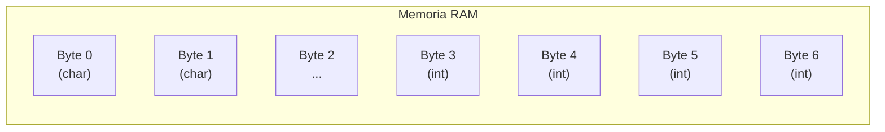
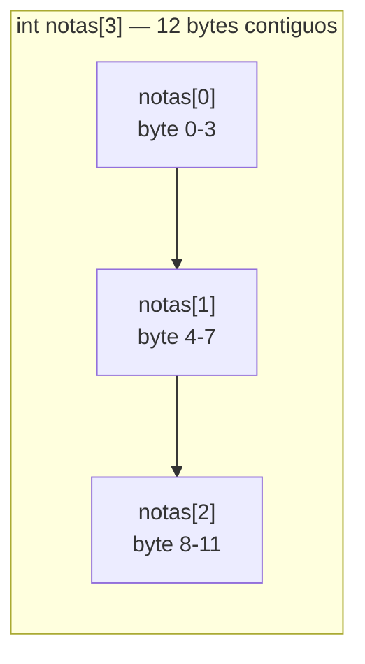
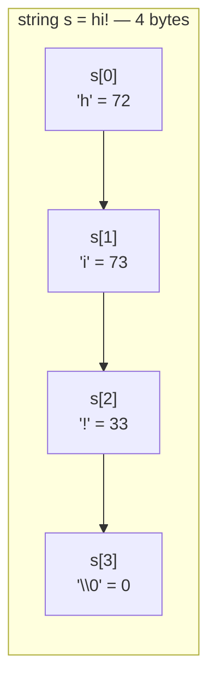
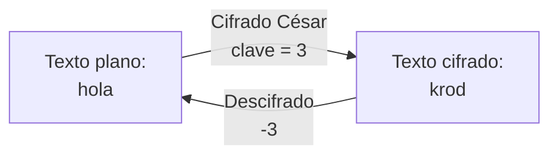

# Clase 2: Arreglos, Strings y Cifrados

Bienvenidos a la Semana 2 de LocalCode (CS50x). Esta semana damos un paso enorme: dejarás de ver la memoria como algo abstracto y empezarás a entenderla concretamente. Aprenderás cómo los *arrays* (arreglos) agrupan datos, cómo los *strings* (cadenas de texto) son simplemente arreglos de caracteres, cómo pasar argumentos a tus programas directamente desde la terminal, y cómo funciona un cifrado clásico de la historia.

---

## Resumen rápido

- Un **arreglo** (*array*) es una secuencia de valores del mismo tipo, almacenados de manera contigua en memoria.
- Los **strings** son arreglos de caracteres (`char`) que siempre terminan con el carácter nulo `\0`.
- Cada carácter tiene un valor numérico definido por el estándar **ASCII**.
- Puedes recibir **argumentos de línea de comandos** en `main` usando `argc` y `argv`.
- El **cifrado César** (*Caesar cipher*) desplaza cada letra del alfabeto un número fijo de posiciones.
- La aritmética modular (`%`) permite que el desplazamiento "dé la vuelta" al final del alfabeto.

---

## 1. La Memoria y los Tipos de Datos

Antes de hablar de arreglos, conviene recordar cuánto espacio ocupa cada tipo de dato en la memoria de tu computadora:

| Tipo     | Bytes | Descripción                            |
|----------|-------|----------------------------------------|
| `bool`   | 1     | Verdadero / falso                      |
| `char`   | 1     | Un solo carácter ASCII                 |
| `int`    | 4     | Entero con signo (~±2 mil millones)    |
| `long`   | 8     | Entero muy grande (~±9 quintillones)   |
| `float`  | 4     | Decimal de precisión simple            |
| `double` | 8     | Decimal de doble precisión             |
| `string` | ?     | Depende de cuántos caracteres escribas |

Imagina que la memoria de tu computadora es una cuadrícula gigante de celdas. Cada celda almacena exactamente 1 byte (8 bits). Cuando declaras una variable de tipo `int`, el sistema te asigna 4 celdas contiguas. Cuando declaras un `char`, solo necesita 1 celda.



---

## 2. El Problema con Múltiples Variables

Supón que quieres guardar tres notas de examen. Una forma naive es esta:

```c
#include <stdio.h>

int main(void)
{
    // Tres variables separadas — diseño pobre
    int nota1 = 72;
    int nota2 = 73;
    int nota3 = 33;

    printf("Promedio: %i\n", (nota1 + nota2 + nota3) / 3);
}
```

Esto funciona, pero no escala. Si el semestre tiene 10 exámenes, necesitas 10 variables. Si mañana cambia a 11, tienes que modificar el código manualmente. Aquí es donde los **arreglos** resuelven el problema.

---

## 3. Arrays en C

Un *array* (arreglo) es una sola variable que puede almacenar múltiples valores del mismo tipo, uno al lado del otro en memoria.

### Declaración

```c
// Sintaxis: tipo nombre[tamaño];
int notas[3];
```

Esto le pide al sistema 3 × 4 = **12 bytes contiguos** en memoria, todos agrupados bajo el nombre `notas`.

### Acceso por índice

Los arreglos en C **siempre empiezan en el índice 0**, no en 1:

```c
notas[0] = 72;   // primer elemento
notas[1] = 73;   // segundo elemento
notas[2] = 33;   // tercer elemento
```

### Ejemplo completo con loop

```c
#include <cs50.h>
#include <stdio.h>

int main(void)
{
    // Declarar arreglo de 3 enteros
    int notas[3];

    // Pedir las 3 notas al usuario con un bucle
    for (int i = 0; i < 3; i++)
    {
        notas[i] = get_int("Nota %i: ", i + 1);
    }

    // Calcular promedio
    int suma = 0;
    for (int i = 0; i < 3; i++)
    {
        suma += notas[i];
    }

    printf("Promedio: %.1f\n", (float) suma / 3);
}
```

### Layout en memoria

Cuando declaras `int notas[3]`, la memoria queda así (cada recuadro = 1 byte):



La **contigüidad** es importante: el programa puede saltar de un elemento al siguiente con solo sumar 4 (el tamaño de un `int`).

---

## 4. Constantes para Evitar "Números Mágicos"

Un *número mágico* (*magic number*) es un literal que aparece en el código sin explicación. Compara:

```c
// MAL: ¿por qué 3? ¿qué significa?
for (int i = 0; i < 3; i++) { ... }
```

```c
// BIEN: el nombre explica el significado
const int TOTAL_NOTAS = 3;
for (int i = 0; i < TOTAL_NOTAS; i++) { ... }
```

Al usar `const`, el compilador rechaza cualquier intento de cambiar ese valor por accidente, y el código se vuelve más legible.

---

## 5. Strings como Arreglos de Chars

La semana pasada usaste `string s = "hola"` como si fuera un tipo mágico. Esta semana levantamos el telón.

Un *string* (cadena de texto) en C **no es más que un arreglo de caracteres** (`char`). La única diferencia con un arreglo de enteros es que al final siempre hay un carácter especial llamado **carácter nulo** (`\0`, valor ASCII 0), que le indica al programa dónde termina el texto.

```c
string s = "hi!";
// En memoria esto es: 'h' 'i' '!' '\0'
// En números ASCII:    72  73  33   0
```



### Acceder a caracteres individuales

Como los strings son arreglos, puedes indexarlos igual:

```c
#include <cs50.h>
#include <stdio.h>

int main(void)
{
    string nombre = get_string("Tu nombre: ");

    // Imprimir cada carácter con su número ASCII
    for (int i = 0; nombre[i] != '\0'; i++)
    {
        printf("Carácter %i: %c  (ASCII: %i)\n", i, nombre[i], nombre[i]);
    }
}
```

Nota que el mismo `nombre[i]` se puede imprimir con `%c` (como letra) o con `%i` (como número). El computador almacena el número; tú eliges cómo mostrarlo.

---

## 6. ASCII: El Código que Une Letras y Números

**ASCII** (*American Standard Code for Information Interchange*) es una tabla que asigna un número entero a cada carácter. Los más importantes para esta semana:

| Carácter | Decimal | Observación                  |
|----------|---------|------------------------------|
| `\0`     | 0       | Fin de string                |
| `A`–`Z`  | 65–90   | Mayúsculas                   |
| `a`–`z`  | 97–122  | Minúsculas                   |
| `0`–`9`  | 48–57   | Dígitos                      |
| `!`      | 33      | Signo de exclamación         |

**Clave del alfabeto:** la diferencia entre una letra mayúscula y su correspondiente minúscula es siempre **32**:

- `'a'` (97) − `'A'` (65) = 32
- `'z'` (122) − `'Z'` (90) = 32

---

## 7. Manipular Strings: Convertir a Mayúsculas

Gracias a ASCII, convertir minúsculas a mayúsculas es solo restar 32. Pero primero hay que verificar que el carácter *es* minúscula.

### Versión manual (sin librerías extra)

```c
#include <cs50.h>
#include <stdio.h>
#include <string.h>  // para strlen

int main(void)
{
    string s = get_string("Texto: ");
    int n = strlen(s);  // longitud del string

    printf("Mayúsculas: ");
    for (int i = 0; i < n; i++)
    {
        // ¿Es minúscula?
        if (s[i] >= 'a' && s[i] <= 'z')
        {
            // Restar 32 convierte a mayúscula
            printf("%c", s[i] - 32);
        }
        else
        {
            // Dejar el carácter sin cambio
            printf("%c", s[i]);
        }
    }
    printf("\n");
}
```

### Versión con `ctype.h` (la forma profesional)

La librería `ctype.h` tiene funciones ya escritas para esto:

```c
#include <cs50.h>
#include <ctype.h>   // islower, toupper
#include <stdio.h>
#include <string.h>

int main(void)
{
    string s = get_string("Texto: ");
    int n = strlen(s);

    printf("Mayúsculas: ");
    for (int i = 0; i < n; i++)
    {
        // toupper convierte a mayúscula; si ya lo es, no cambia nada
        printf("%c", toupper(s[i]));
    }
    printf("\n");
}
```

Funciones útiles de `ctype.h`:

| Función      | Qué hace                               |
|--------------|----------------------------------------|
| `isupper(c)` | Devuelve verdadero si `c` es mayúscula |
| `islower(c)` | Devuelve verdadero si `c` es minúscula |
| `isalpha(c)` | Devuelve verdadero si `c` es letra     |
| `isdigit(c)` | Devuelve verdadero si `c` es dígito    |
| `toupper(c)` | Convierte `c` a mayúscula              |
| `tolower(c)` | Convierte `c` a minúscula              |

### Eficiencia: calcular `strlen` solo una vez

Un error común es llamar `strlen` en cada iteración del bucle:

```c
// INEFICIENTE: strlen se llama en cada iteración
for (int i = 0; i < strlen(s); i++) { ... }

// EFICIENTE: calcular la longitud una sola vez
int n = strlen(s);
for (int i = 0; i < n; i++) { ... }
```

La longitud del string no cambia dentro del bucle, así que no tiene sentido recalcularla.

---

## 8. `strlen` y la Librería `string.h`

La función `strlen` (*string length*) devuelve cuántos caracteres tiene un string, sin contar el `\0` final.

```c
#include <string.h>

int n = strlen("David");  // n = 5
int m = strlen("hi!");    // m = 3
```

¿Cómo funciona por dentro? Exactamente como el bucle que vimos antes: recorre el arreglo hasta encontrar `\0` y cuenta los pasos.

---

## 9. Argumentos de Línea de Comandos: `argc` y `argv`

Hasta ahora, `main` siempre ha tenido esta firma:

```c
int main(void)
```

El `void` significa que el programa no acepta argumentos de la terminal. Para que sí los acepte, cambia la firma a:

```c
int main(int argc, string argv[])
```

- `argc` (*argument count*): cuántas palabras escribió el usuario en la terminal (incluyendo el nombre del programa).
- `argv` (*argument vector*): un arreglo de strings con cada palabra.

### Ejemplo

Si el usuario ejecuta:
```
./saludar David
```

Entonces:
- `argc` = 2
- `argv[0]` = `"./saludar"`
- `argv[1]` = `"David"`

```c
#include <cs50.h>
#include <stdio.h>

int main(int argc, string argv[])
{
    // Verificar que el usuario proporcionó exactamente un nombre
    if (argc != 2)
    {
        printf("Uso: ./saludar <nombre>\n");
        return 1;  // código de salida distinto de cero indica error
    }

    printf("Hola, %s!\n", argv[1]);
    return 0;  // éxito
}
```

### Códigos de salida (`return` en `main`)

El valor que devuelve `main` se llama **código de salida** (*exit status*):

- `return 0` — el programa terminó correctamente.
- `return 1` (o cualquier otro número) — algo salió mal.

Puedes verlo en la terminal con:
```bash
echo $?
```

---

## 10. Criptografía y el Cifrado César

La **criptografía** es el arte de transformar un mensaje legible (*texto plano*) en un mensaje ilegible (*texto cifrado*), de modo que solo quien conozca el algoritmo y la clave pueda descifrarlo.

### ¿Qué es el Cifrado César?

El **cifrado César** es uno de los algoritmos de cifrado más antiguos. Funciona desplazando cada letra del alfabeto un número fijo de posiciones (la *clave*).

Por ejemplo, con clave = 1:
- `A` → `B`
- `B` → `C`
- ...
- `Z` → `A` (da la vuelta)

Con clave = 13 (conocido como ROT13):
- `H` → `U`
- `I` → `V`



### Cómo funciona en código

La clave es la **aritmética modular**. El operador `%` (módulo) da el residuo de una división. Para que el desplazamiento dé la vuelta correctamente al final del alfabeto:

```
posición_cifrada = (posición_original + clave) % 26
```

Ejemplo con `'Z'` (posición 25) y clave 3:
```
(25 + 3) % 26 = 28 % 26 = 2  →  'C'
```

### Implementación en C

```c
#include <cs50.h>
#include <ctype.h>
#include <stdio.h>
#include <stdlib.h>
#include <string.h>

int main(int argc, string argv[])
{
    // La clave llega como argumento de línea de comandos
    if (argc != 2)
    {
        printf("Uso: ./caesar <clave>\n");
        return 1;
    }

    // Convertir el argumento (string) a entero
    int clave = atoi(argv[1]);

    // Pedir el texto plano
    string texto = get_string("Texto plano: ");
    int n = strlen(texto);

    printf("Texto cifrado: ");
    for (int i = 0; i < n; i++)
    {
        char c = texto[i];

        if (isupper(c))
        {
            // Desplazar letra mayúscula, manteniendo en rango A-Z
            printf("%c", (char)(((c - 'A') + clave) % 26) + 'A');
        }
        else if (islower(c))
        {
            // Desplazar letra minúscula, manteniendo en rango a-z
            printf("%c", (char)(((c - 'a') + clave) % 26) + 'a');
        }
        else
        {
            // Números, espacios y signos no se cifran
            printf("%c", c);
        }
    }
    printf("\n");
    return 0;
}
```

### Truco clave: restar la base

La expresión `c - 'A'` convierte una letra mayúscula en su **posición en el alfabeto** (0 a 25):
- `'A' - 'A'` = 0
- `'B' - 'A'` = 1
- `'Z' - 'A'` = 25

Después de aplicar `% 26`, sumamos `'A'` para volver al rango ASCII correcto.

---

## 11. El Cifrado de Sustitución

Una generalización del César: en lugar de desplazar por una clave numérica, defines una tabla de sustitución donde cada letra del alfabeto se mapea a otra letra diferente. La clave es esa tabla de 26 letras.

```
Clave:    qwertyuiopasdfghjklzxcvbnm
Alfabeto: abcdefghijklmnopqrstuvwxyz

'a' → 'q', 'b' → 'w', 'c' → 'e', ...
```

El texto "hello" con esa clave se cifraría como "itssg" (los índices de h, e, l, l, o en el alfabeto se sustituyen por los caracteres en esas posiciones de la clave).

---

## 12. Legibilidad de Texto: Índice Coleman-Liau

Un problema diferente esta semana: ¿cómo mide una computadora qué tan difícil es leer un texto?

El **índice Coleman-Liau** usa la fórmula:

```
índice = 0.0588 * L - 0.296 * S - 15.8
```

Donde:
- `L` = promedio de letras por cada 100 palabras
- `S` = promedio de oraciones por cada 100 palabras

Para calcularlo, tu programa necesita contar:
1. Cuántas **letras** tiene el texto (`isalpha`).
2. Cuántas **palabras** tiene (separadas por espacios).
3. Cuántas **oraciones** hay (terminadas en `.`, `!` o `?`).

---

## Resumen Final

Esta semana conectaste muchos conceptos:

1. **Arreglos** almacenan múltiples valores del mismo tipo de forma contigua.
2. **Strings** son arreglos de `char` con un `\0` al final.
3. **ASCII** permite tratar letras como números y hacer aritmética con ellas.
4. **`strlen`**, **`isupper`**, **`toupper`** y otras funciones de librería evitan reinventar la rueda.
5. **`argc`/`argv`** permiten que tu programa reciba instrucciones desde la terminal.
6. El **cifrado César** aplica aritmética modular sobre posiciones ASCII para cifrar texto.

La próxima semana profundizaremos en algoritmos de búsqueda y ordenamiento sobre arreglos.
