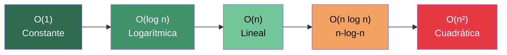
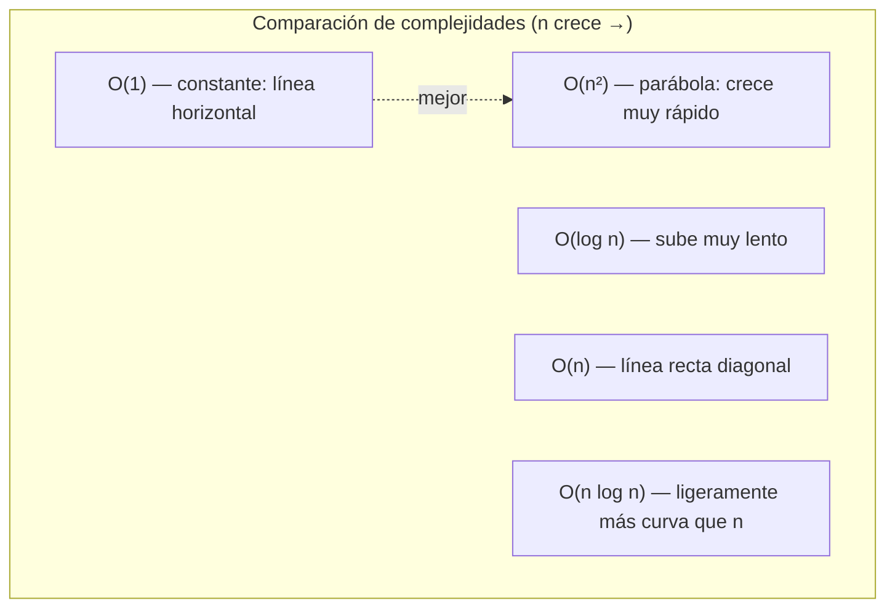

# Clase 3: Algoritmos de Búsqueda y Ordenamiento

Esta semana formalizamos ideas que ya intuías desde la Semana 0: buscar y ordenar datos. Aprenderás a escribir esos algoritmos en C, a medir su eficiencia con la notación **Big-O** y a entender la recursión como técnica de diseño.

**Lo que aprenderás:**
- Búsqueda lineal vs. búsqueda binaria
- Ordenamiento de burbuja (Bubble Sort), por selección (Selection Sort) y por mezcla (Merge Sort)
- Notación Big-O, Omega y Theta
- Recursión y caso base

---

## 1. El Problema de la Búsqueda

Imagina que tu computadora guarda un arreglo de siete números en memoria:

```
[20, 500, 10, 5, 100, 1, 50]
```

Desde tu perspectiva humana puedes ver todos los valores de un vistazo. La computadora, en cambio, solo puede inspeccionar una celda a la vez: es como una fila de casilleros cerrados donde debes abrir uno por uno.

La pregunta es: **¿cuál es la estrategia más eficiente para encontrar un valor?**

---

## 2. Búsqueda Lineal (Linear Search)

### ¿Qué hace?

Revisa cada elemento del arreglo de izquierda a derecha hasta encontrar el valor buscado o agotar todos los elementos.

### Pseudocódigo

```
Para cada casillero de izquierda a derecha:
    Si el valor buscado está en este casillero:
        Retornar verdadero
Retornar falso
```

> **Error común:** usar `if / else` dentro del bucle haría que el algoritmo retornara `falso` en el primer elemento que *no* sea el buscado, antes de revisar el resto.

### Implementación en C

```c
#include <cs50.h>
#include <stdio.h>

int main(void)
{
    // Arreglo estático de números (como los casilleros del ejemplo)
    int numeros[] = {20, 500, 10, 5, 100, 1, 50};

    // Pedimos al usuario qué número buscar
    int n = get_int("Número a buscar: ");

    // Recorremos el arreglo elemento por elemento
    for (int i = 0; i < 7; i++)
    {
        if (numeros[i] == n)
        {
            printf("¡Encontrado!\n");
            return 0; // Éxito: salimos del programa
        }
    }

    // Si llegamos aquí, no estaba en el arreglo
    printf("No encontrado.\n");
    return 1; // Código de error: no se encontró
}
```

### Complejidad

| Caso | Notación | Explicación |
|------|----------|-------------|
| Peor caso (Big-O) | O(n) | El elemento está al final o no existe |
| Mejor caso (Omega) | Ω(1) | El elemento está en la primera posición |

---

## 3. Búsqueda Binaria (Binary Search)

### ¿Qué hace?

Divide el arreglo a la mitad en cada paso. **Requisito indispensable:** el arreglo debe estar ordenado previamente.

### Pseudocódigo

```
Si no quedan casilleros:
    Retornar falso
Si el valor está en el casillero del medio:
    Retornar verdadero
Si el valor es menor que el del medio:
    Buscar en la mitad izquierda
Si el valor es mayor que el del medio:
    Buscar en la mitad derecha
```

### ¿Por qué funciona?

Con 7 elementos, el medio está en el índice 3 (posición 0→6, mitad = 3).
Si el valor no está ahí, descartamos la mitad que no puede contenerlo y repetimos sobre la otra mitad, que ahora tiene ≈ 3 elementos. En el peor caso, con 7 elementos hacemos solo 3 comparaciones (porque log₂(8) = 3).

### Complejidad

| Caso | Notación | Explicación |
|------|----------|-------------|
| Peor caso (Big-O) | O(log n) | Dividimos a la mitad en cada paso |
| Mejor caso (Omega) | Ω(1) | El elemento está justo en el medio |

---

## 4. Notación Big-O: Midiendo la Eficiencia

La notación **Big-O** describe el límite superior del tiempo que tarda un algoritmo en función del tamaño de la entrada `n`. No nos importan las constantes (2n y n son "iguales" en Big-O) porque lo relevante es la *forma* de la curva cuando n crece mucho.

### Jerarquía de complejidades (de más rápido a más lento)



### Tabla de referencia rápida

| Notación | Nombre | Ejemplo típico |
|----------|--------|----------------|
| O(1) | Constante | Acceder a `array[i]` |
| O(log n) | Logarítmica | Búsqueda binaria |
| O(n) | Lineal | Búsqueda lineal |
| O(n log n) | n-log-n | Merge Sort |
| O(n²) | Cuadrática | Bubble Sort, Selection Sort |

### Omega (Ω) y Theta (Θ)

- **Ω (Omega):** límite inferior — el mejor caso posible.
- **Θ (Theta):** cuando el límite superior e inferior coinciden (el algoritmo siempre tarda lo mismo sin importar los datos).

---

## 5. Ordenamiento por Selección (Selection Sort)

### Idea

Busca el elemento más pequeño en el subarreglo no ordenado y lo intercambia con la primera posición de ese subarreglo. Repite hasta que todo esté ordenado.

### Pseudocódigo

```
Para i desde 0 hasta n-1:
    Encontrar el elemento más pequeño entre numeros[i] y numeros[n-1]
    Intercambiar ese elemento con numeros[i]
```

### Implementación en C

```c
#include <stdio.h>

// Función auxiliar para intercambiar dos enteros
void intercambiar(int *a, int *b)
{
    int temp = *a;
    *a = *b;
    *b = temp;
}

void selection_sort(int arr[], int n)
{
    for (int i = 0; i < n - 1; i++)
    {
        // Encontrar el índice del mínimo en arr[i..n-1]
        int idx_min = i;
        for (int j = i + 1; j < n; j++)
        {
            if (arr[j] < arr[idx_min])
            {
                idx_min = j; // Actualizamos el índice del mínimo
            }
        }
        // Colocar el mínimo encontrado en la posición correcta
        intercambiar(&arr[i], &arr[idx_min]);
    }
}

int main(void)
{
    int numeros[] = {7, 2, 5, 4, 1, 6, 0, 3};
    int n = 8;

    selection_sort(numeros, n);

    for (int i = 0; i < n; i++)
    {
        printf("%d ", numeros[i]);
    }
    printf("\n"); // Imprime: 0 1 2 3 4 5 6 7
}
```

### Análisis de complejidad

- Primera pasada: n-1 comparaciones
- Segunda pasada: n-2 comparaciones
- ...
- Total: (n-1) + (n-2) + ... + 1 = n(n-1)/2 ≈ **n²/2**

Independientemente de si el arreglo ya está ordenado o no, Selection Sort siempre hace las mismas comparaciones. Por eso:

- **Big-O:** O(n²)
- **Omega:** Ω(n²)
- **Theta:** Θ(n²) — siempre tarda lo mismo

---

## 6. Ordenamiento de Burbuja (Bubble Sort)

### Idea

Compara pares de elementos adyacentes e intercámbia los que estén desordenados. Los valores grandes "burbujean" hacia el final del arreglo en cada pasada.

### Pseudocódigo

```
Repetir n-1 veces:
    Para i desde 0 hasta n-2:
        Si numeros[i] > numeros[i+1]:
            Intercambiar numeros[i] y numeros[i+1]
    Si no hubo ningún intercambio en esta pasada:
        Terminar (el arreglo ya está ordenado)
```

> **Detalle importante:** el índice llega hasta `n-2` (no `n-1`) porque comparamos `arr[i]` con `arr[i+1]`. Si llegaras a `n-1`, intentarías acceder a `arr[n]` que está fuera del arreglo — esto causa un *segmentation fault*.

### Implementación en C

```c
#include <stdio.h>
#include <stdbool.h>

void bubble_sort(int arr[], int n)
{
    for (int pasada = 0; pasada < n - 1; pasada++)
    {
        bool hubo_intercambio = false; // Bandera para detectar si ya está ordenado

        for (int i = 0; i < n - 1 - pasada; i++)
        {
            if (arr[i] > arr[i + 1])
            {
                // Intercambiar elementos adyacentes
                int temp = arr[i];
                arr[i] = arr[i + 1];
                arr[i + 1] = temp;
                hubo_intercambio = true;
            }
        }

        // Optimización: si no hubo intercambios, el arreglo ya está ordenado
        if (!hubo_intercambio)
        {
            break;
        }
    }
}

int main(void)
{
    int numeros[] = {7, 2, 5, 4, 1, 6, 0, 3};
    int n = 8;

    bubble_sort(numeros, n);

    for (int i = 0; i < n; i++)
    {
        printf("%d ", numeros[i]);
    }
    printf("\n"); // Imprime: 0 1 2 3 4 5 6 7
}
```

### Análisis de complejidad

- **Big-O:** O(n²) — mismo orden que Selection Sort en el peor caso
- **Omega:** Ω(n) — si el arreglo ya está ordenado, detecta la ausencia de intercambios y termina en una sola pasada (con la optimización de la bandera)

A diferencia de Selection Sort, Bubble Sort **sí puede terminar antes** si los datos ya están ordenados o casi ordenados. Esto lo hace preferible en la práctica para datos parcialmente ordenados.

---

## 7. Recursión

### ¿Qué es?

Una función es **recursiva** cuando se llama a sí misma. La clave es que en cada llamada recursiva, el problema debe hacerse *más pequeño*, y debe existir un **caso base** que detenga la recursión.

### Dos componentes indispensables

1. **Caso base:** condición que detiene la recursión (sin ella, el programa corre infinitamente).
2. **Llamada recursiva:** invocación de la misma función con un problema más pequeño.

### Ejemplo: pirámide de bloques

La función `dibujar(n)` dibuja una pirámide de altura n.

```c
#include <cs50.h>
#include <stdio.h>

// Prototipo de la función
void dibujar(int n);

int main(void)
{
    int altura = get_int("Altura de la pirámide: ");
    dibujar(altura);
}

void dibujar(int n)
{
    // CASO BASE: si n es 0 o negativo, no hay nada que dibujar
    if (n <= 0)
    {
        return;
    }

    // LLAMADA RECURSIVA: primero dibujar la pirámide de altura n-1
    dibujar(n - 1);

    // Luego dibujar la fila actual (n bloques)
    for (int i = 0; i < n; i++)
    {
        printf("#");
    }
    printf("\n");
}
```

Ejecución con `n = 4`:
```
#
##
###
####
```

### ¿Por qué no es un bucle infinito?

- `dibujar(4)` llama a `dibujar(3)`
- `dibujar(3)` llama a `dibujar(2)`
- `dibujar(2)` llama a `dibujar(1)`
- `dibujar(1)` llama a `dibujar(0)`
- `dibujar(0)` encuentra `n <= 0` → **retorna** (caso base)
- Toda la cadena se "desenrolla" de abajo hacia arriba, imprimiendo las filas en orden.

### La recursión en búsqueda binaria

El pseudocódigo de búsqueda binaria que vimos es **implícitamente recursivo**: "buscar en la mitad izquierda / derecha" es el mismo algoritmo aplicado sobre un problema más pequeño (la mitad).

---

## 8. Ordenamiento por Mezcla (Merge Sort)

Merge Sort aprovecha la recursión para lograr una complejidad mejor que O(n²).

### Pseudocódigo

```
Si el arreglo tiene solo 1 elemento:
    Ya está ordenado → retornar
Ordenar la mitad izquierda
Ordenar la mitad derecha
Mezclar las dos mitades ordenadas
```

### ¿Cómo funciona la mezcla?

Dadas dos mitades ya ordenadas:
```
Mitad izquierda: [2, 4, 5, 7]
Mitad derecha:   [0, 1, 3, 6]
```

Se comparan los primeros elementos de cada mitad y se toma el menor. Se avanza en esa mitad y se repite:

```
Comparar 2 vs 0 → tomar 0    → [0]
Comparar 2 vs 1 → tomar 1    → [0, 1]
Comparar 2 vs 3 → tomar 2    → [0, 1, 2]
Comparar 4 vs 3 → tomar 3    → [0, 1, 2, 3]
Comparar 4 vs 6 → tomar 4    → [0, 1, 2, 3, 4]
Comparar 5 vs 6 → tomar 5    → [0, 1, 2, 3, 4, 5]
Comparar 7 vs 6 → tomar 6    → [0, 1, 2, 3, 4, 5, 6]
Queda el 7      → tomar 7    → [0, 1, 2, 3, 4, 5, 6, 7]
```

Los punteros solo avanzan hacia la derecha, nunca retroceden.

### Implementación en C

```c
#include <stdio.h>
#include <stdlib.h>

// Función que mezcla dos mitades del arreglo
void mezclar(int arr[], int izq, int mid, int der)
{
    int n1 = mid - izq + 1; // Tamaño de la mitad izquierda
    int n2 = der - mid;     // Tamaño de la mitad derecha

    // Arreglos auxiliares temporales
    int *L = malloc(n1 * sizeof(int));
    int *R = malloc(n2 * sizeof(int));

    // Copiar datos a los arreglos temporales
    for (int i = 0; i < n1; i++) L[i] = arr[izq + i];
    for (int j = 0; j < n2; j++) R[j] = arr[mid + 1 + j];

    // Mezclar los arreglos temporales de vuelta en arr[]
    int i = 0, j = 0, k = izq;
    while (i < n1 && j < n2)
    {
        if (L[i] <= R[j])
        {
            arr[k] = L[i];
            i++;
        }
        else
        {
            arr[k] = R[j];
            j++;
        }
        k++;
    }

    // Copiar los elementos restantes de L[] (si quedan)
    while (i < n1) { arr[k] = L[i]; i++; k++; }
    // Copiar los elementos restantes de R[] (si quedan)
    while (j < n2) { arr[k] = R[j]; j++; k++; }

    free(L);
    free(R);
}

// Función recursiva principal de Merge Sort
void merge_sort(int arr[], int izq, int der)
{
    if (izq >= der)
    {
        return; // CASO BASE: subarreglo de 0 o 1 elementos ya está ordenado
    }

    int mid = izq + (der - izq) / 2; // Punto medio (evita desbordamiento)

    merge_sort(arr, izq, mid);     // Ordenar mitad izquierda
    merge_sort(arr, mid + 1, der); // Ordenar mitad derecha
    mezclar(arr, izq, mid, der);   // Mezclar las dos mitades
}

int main(void)
{
    int numeros[] = {7, 2, 5, 4, 1, 6, 0, 3};
    int n = 8;

    merge_sort(numeros, 0, n - 1);

    for (int i = 0; i < n; i++)
    {
        printf("%d ", numeros[i]);
    }
    printf("\n"); // Imprime: 0 1 2 3 4 5 6 7
}
```

### Análisis de complejidad

¿Cuántas veces divide Merge Sort el arreglo? Si hay 8 elementos, divide 3 veces (log₂ 8 = 3). En cada "nivel" de divisiones, mezcla todos los n elementos exactamente una vez. Por lo tanto:

- **n** elementos mezclados en **log n** niveles = **n log n** operaciones totales
- **Big-O:** O(n log n)
- **Omega:** Ω(n log n) — incluso si el arreglo ya está ordenado, recorre todos los niveles
- **Theta:** Θ(n log n)

**Costo adicional:** Merge Sort necesita memoria auxiliar (los arreglos temporales L y R). A diferencia de Bubble Sort y Selection Sort que ordenan "in-place", Merge Sort intercambia tiempo por espacio.

---

## 9. Comparación Final de Algoritmos

### Tabla de complejidades

| Algoritmo | Big-O (peor caso) | Omega (mejor caso) | Theta | In-place |
|-----------|-------------------|--------------------|-------|----------|
| Búsqueda lineal | O(n) | Ω(1) | — | — |
| Búsqueda binaria | O(log n) | Ω(1) | — | — |
| Selection Sort | O(n²) | Ω(n²) | Θ(n²) | Sí |
| Bubble Sort | O(n²) | Ω(n) | — | Sí |
| Merge Sort | O(n log n) | Ω(n log n) | Θ(n log n) | No |

### Diagrama de comparación de curvas de crecimiento



### ¿Cuándo conviene cada algoritmo?

- **Búsqueda lineal:** cuando el arreglo es pequeño o no está ordenado y solo buscas una vez.
- **Búsqueda binaria:** cuando el arreglo está ordenado y buscarás muchas veces.
- **Selection / Bubble Sort:** arreglos pequeños o cuando el espacio extra es un problema.
- **Merge Sort:** arreglos medianos o grandes donde la velocidad importa más que el espacio.

---

## 10. Strings en Búsqueda: `strcmp`

Cuando buscas strings en C, no puedes usar `==` porque compara direcciones de memoria, no el contenido. Debes usar `strcmp` de `<string.h>`:

```c
#include <cs50.h>
#include <stdio.h>
#include <string.h>

int main(void)
{
    // Arreglo de piezas de Monopoly
    string piezas[] = {"barco", "bota", "cañón", "plancha", "dedal", "sombrero"};

    string buscar = get_string("¿Qué pieza buscas? ");

    for (int i = 0; i < 6; i++)
    {
        // strcmp retorna 0 si las cadenas son iguales
        if (strcmp(piezas[i], buscar) == 0)
        {
            printf("¡Encontrado en posición %d!\n", i);
            return 0;
        }
    }

    printf("No encontrado.\n");
    return 1;
}
```

`strcmp` también retorna un número negativo si el primer string va antes alfabéticamente, y positivo si va después. Esto es útil para ordenar strings.
