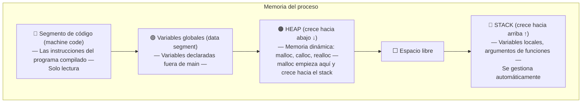
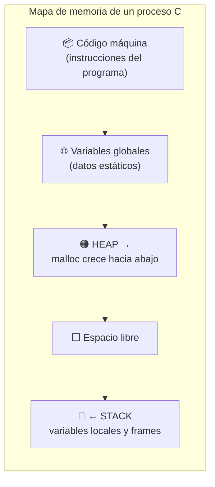

# Clase 4: Memoria, Punteros y Archivos

En esta semana quitamos las últimas ruedas de entrenamiento. Verás cómo funciona la memoria de tu computadora, qué son los punteros, cómo pedir y liberar memoria dinámicamente, y cómo leer y escribir archivos desde C. Estos conceptos son la base de casi todo el software del mundo real.

---

## Resumen rápido

| Concepto | Qué es |
|---|---|
| **Puntero** | Variable que almacena una dirección de memoria |
| `&variable` | Obtiene la dirección de una variable |
| `*puntero` | Va a la dirección y accede al valor (desreferencia) |
| **Stack** | Zona de memoria para variables locales y funciones (automática) |
| **Heap** | Zona de memoria dinámica gestionada con `malloc`/`free` |
| `malloc(n)` | Pide `n` bytes al sistema operativo; devuelve la dirección |
| `free(ptr)` | Devuelve la memoria al sistema operativo |
| **Memory leak** | Memoria pedida con `malloc` que nunca se libera con `free` |
| **Segfault** | Crash por tocar memoria que no te pertenece |
| `fopen`/`fclose` | Abrir y cerrar archivos |
| `fread`/`fwrite` | Leer y escribir datos binarios en archivos |

---

## 1. El Modelo de Memoria de C

Cuando ejecutas un programa en C, el sistema operativo le asigna un bloque de memoria dividido en cuatro regiones principales:



### Stack (pila)

El **stack** almacena los *frames* de cada función activa. Cuando llamas a `main`, se crea un frame para `main`. Si `main` llama a `swap`, se apila un frame para `swap` encima del de `main`. Cuando `swap` termina, su frame desaparece automáticamente.

- Variables locales viven aquí.
- Se gestionan automáticamente (sin `malloc`, sin `free`).
- Tiene tamaño limitado: demasiada recursión produce **stack overflow**.

### Heap (montón)

El **heap** es la zona de memoria que tú gestionas manualmente:

- `malloc` toma bytes del heap y te da la dirección.
- Crece hacia la dirección del stack; si se juntan → crash.
- Si pides memoria y nunca la liberas → **memory leak**.

---

## 2. Punteros: qué son y cómo se usan

Un **puntero** es simplemente una variable que guarda una dirección de memoria. Nada más, nada menos.

### Los dos operadores clave

| Operador | Nombre | Qué hace |
|---|---|---|
| `&` | Ampersand (dirección de) | Devuelve la dirección en memoria de una variable |
| `*` | Asterisco (desreferencia) | Va a esa dirección y accede al valor |

```c
#include <stdio.h>

int main(void)
{
    int n = 50;         // variable entera en el stack

    int *p = &n;        // p es un puntero: guarda la dirección de n
                        // &n significa "la dirección donde vive n"

    printf("Valor de n:          %d\n",  n);   // 50
    printf("Dirección de n:      %p\n",  p);   // algo como 0x7ffd4a3c1234
    printf("Valor via puntero:   %d\n", *p);   // 50 — desreferencia: "ve a esa dirección"

    *p = 100;           // cambia el valor en la dirección que apunta p
    printf("n después de *p=100: %d\n",  n);   // 100 — ¡n cambió!

    return 0;
}
```

> **Regla de lectura:** `int *p` se lee "p es un puntero a int". El `*` aquí es parte del tipo, no una desreferencia.

### Por qué existen los punteros

En C, cuando pasas una variable a una función, se pasa **por valor** (una copia). La función no puede modificar la original. Los punteros permiten pasar **por referencia** (la dirección), de modo que la función sí puede modificar la variable original.

```c
#include <stdio.h>

/* Versión INCORRECTA: swap recibe copias, no modifica x ni y */
void swap_mal(int a, int b)
{
    int temp = a;
    a = b;
    b = temp;
    /* a y b son variables locales — desaparecen al salir de swap */
}

/* Versión CORRECTA: recibe direcciones, modifica los originales */
void swap(int *a, int *b)
{
    int temp = *a;  // temp = valor en la dirección de a
    *a = *b;        // coloca en la dirección de a el valor de b
    *b = temp;      // coloca en la dirección de b el valor temporal
}

int main(void)
{
    int x = 1, y = 2;

    printf("Antes:  x=%d  y=%d\n", x, y);

    swap(&x, &y);   // pasamos las DIRECCIONES de x e y

    printf("Después: x=%d  y=%d\n", x, y);   // x=2  y=1

    return 0;
}
```

---

## 3. Strings son punteros

Ahora que entiendes punteros, el gran secreto queda al descubierto: `string` de la librería CS50 no es un tipo real de C. Es un alias (*typedef*) de `char *`, es decir, un puntero al primer carácter.

```c
#include <stdio.h>

int main(void)
{
    /* Sin CS50: declaramos s como puntero a char */
    char *s = "hola";

    /* s contiene la dirección del primer byte ('h') */
    printf("s[0] = %c\n", s[0]);     /* notación de array: 'h'  */
    printf("*s   = %c\n", *s);       /* desreferencia:     'h'  */
    printf("s+1  = %s\n", s + 1);    /* aritmética:        "ola" */

    return 0;
}
```

### Por qué `==` no compara strings

Cuando haces `if (s == t)` con dos strings, comparas las **direcciones** (¿apuntan al mismo lugar?), no los **contenidos**. Dos strings iguales escritas por el usuario viven en direcciones distintas.

```c
#include <stdio.h>
#include <string.h>    /* para strcmp */
#include <cs50.h>

int main(void)
{
    string s = get_string("Dame una palabra: ");
    string t = get_string("Repítela: ");

    /* INCORRECTO: compara direcciones, siempre diferente */
    if (s == t)
        printf("¡Iguales! (mentira)\n");

    /* CORRECTO: strcmp compara carácter por carácter */
    if (strcmp(s, t) == 0)
        printf("¡Son la misma palabra!\n");
    else
        printf("Son distintas.\n");

    return 0;
}
```

---

## 4. Aritmética de Punteros

Como un puntero es una dirección (un número), puedes sumarle enteros para moverte por la memoria.

```c
#include <stdio.h>

int main(void)
{
    char *s = "HI!";   /* H en 0x123, I en 0x124, ! en 0x125 */

    /* Tres formas equivalentes de acceder al segundo carácter: */
    printf("%c\n", s[1]);       /* notación array — azúcar sintáctico     */
    printf("%c\n", *(s + 1));   /* aritmética de punteros — equivalente   */

    /* El compilador sabe cuántos bytes avanzar según el tipo:
       char → 1 byte, int → 4 bytes, double → 8 bytes, etc. */

    int nums[] = {10, 20, 30};
    int *p = nums;

    printf("%d\n", *(p + 0));   /* 10 — avanza 0 × sizeof(int) = 0 bytes */
    printf("%d\n", *(p + 1));   /* 20 — avanza 1 × sizeof(int) = 4 bytes */
    printf("%d\n", *(p + 2));   /* 30 — avanza 2 × sizeof(int) = 8 bytes */

    return 0;
}
```

> **Peligro:** Nada impide hacer `s + 50000` y leer memoria que no te pertenece. El sistema operativo te cortará con un **segmentation fault**.

---

## 5. malloc y free: memoria dinámica

### ¿Cuándo necesitas `malloc`?

Cuando no sabes en tiempo de compilación cuántos bytes necesitas, o cuando necesitas que la memoria sobreviva al retorno de una función.

```c
#include <stdio.h>
#include <stdlib.h>    /* malloc, free */
#include <string.h>    /* strcpy, strlen */

int main(void)
{
    /* Pedimos memoria para copiar una cadena */
    char *original = "mundo";
    int longitud = strlen(original);

    /* malloc devuelve void* — C lo convierte automáticamente */
    /* Siempre pedimos longitud + 1 para el byte nulo '\0'   */
    char *copia = malloc(longitud + 1);

    /* malloc puede fallar si no hay memoria disponible */
    if (copia == NULL)
    {
        printf("Error: sin memoria\n");
        return 1;
    }

    /* Copiamos el contenido (strcpy incluye el '\0') */
    strcpy(copia, original);

    /* Modificamos solo la copia */
    copia[0] = 'M';

    printf("Original: %s\n", original);   /* mundo  */
    printf("Copia:    %s\n", copia);      /* Mundo  */

    /* OBLIGATORIO: devolver la memoria al sistema operativo */
    free(copia);

    return 0;
}
```

### malloc para arrays dinámicos

```c
#include <stdio.h>
#include <stdlib.h>

int main(void)
{
    int n = 3;

    /* Pedimos espacio para 3 enteros: 3 × 4 bytes = 12 bytes */
    int *arr = malloc(n * sizeof(int));

    if (arr == NULL)
        return 1;

    /* Usamos el array igual que uno declarado en el stack */
    arr[0] = 72;    /* 'H' en ASCII */
    arr[1] = 73;    /* 'I' en ASCII */
    arr[2] = 33;    /* '!' en ASCII */

    for (int i = 0; i < n; i++)
        printf("arr[%d] = %d\n", i, arr[i]);

    /* Liberamos cuando ya no lo necesitamos */
    free(arr);

    return 0;
}
```

### La regla de oro

> **Cada `malloc` debe tener exactamente un `free`.**

| Qué pasa | Consecuencia |
|---|---|
| Olvidas `free` | Memory leak: la RAM se agota con el tiempo |
| Haces `free` dos veces | Double free: comportamiento indefinido, posible crash |
| Usas el puntero después de `free` | Dangling pointer: lees basura o crasheas |
| `free` en puntero NULL | Seguro: `free(NULL)` no hace nada |

---

## 6. Errores comunes de memoria

### 6.1 Memory Leak (fuga de memoria)

```c
/* INCORRECTO: se pide memoria pero nunca se libera */
void fuga(void)
{
    char *s = malloc(10);
    /* ... usamos s ... */
    /* ¡falta free(s)! */
}  /* s desaparece del stack, pero los 10 bytes siguen ocupados en el heap */
```

Si esta función se llama en un bucle, la memoria se agota progresivamente. Chrome, Firefox, y muchas apps tienen este bug; por eso se "comen la RAM" con el tiempo.

### 6.2 Dangling Pointer (puntero colgante)

```c
/* INCORRECTO: usar memoria después de liberarla */
int *p = malloc(sizeof(int));
*p = 42;
free(p);
printf("%d\n", *p);   /* comportamiento indefinido — p apunta a memoria liberada */

/* SOLUCIÓN: poner p a NULL después de free */
free(p);
p = NULL;
```

### 6.3 Buffer Overflow (desbordamiento de búfer)

```c
/* INCORRECTO: escribir más allá del límite del array */
int arr[3] = {0};
arr[0] = 1;
arr[1] = 2;
arr[2] = 3;
arr[3] = 4;    /* ¡fuera de límites! — pisas memoria ajena */
```

Los buffer overflows son una de las vulnerabilidades de seguridad más explotadas de la historia. Permiten a un atacante inyectar código malicioso.

### 6.4 NULL sin verificar

```c
/* INCORRECTO: usar el resultado de malloc sin verificar */
int *p = malloc(1000000000 * sizeof(int));   /* podría fallar */
*p = 5;    /* si p == NULL, esto es un segfault */

/* CORRECTO: siempre verificar */
int *p = malloc(1000000000 * sizeof(int));
if (p == NULL)
{
    fprintf(stderr, "Error: memoria insuficiente\n");
    return 1;
}
*p = 5;
```

---

## 7. Valgrind: detecta errores de memoria

**Valgrind** es una herramienta que analiza tu programa en ejecución y reporta errores de memoria.

```bash
# Compilar con información de depuración
gcc -g -o mi_programa mi_programa.c

# Ejecutar con valgrind
valgrind ./mi_programa
```

### Ejemplo de memoria con bugs

```c
/* archivo: memory.c */
#include <stdlib.h>

int main(void)
{
    /* Pedimos memoria para 3 enteros */
    int *x = malloc(3 * sizeof(int));

    /* BUG 1: índice fuera de rango (debería ser 0, 1, 2) */
    x[1] = 72;
    x[2] = 73;
    x[3] = 33;   /* ← escribe fuera del bloque asignado */

    /* BUG 2: no llamamos free(x) → memory leak */

    return 0;
}
```

Salida de Valgrind (resumida):
```
Invalid write of size 4         ← Bug 1: escritura fuera de límites
  at memory.c:9

12 bytes in 1 blocks definitely lost   ← Bug 2: memory leak
  at memory.c:5
```

### Versión corregida

```c
#include <stdlib.h>

int main(void)
{
    int *x = malloc(3 * sizeof(int));

    if (x == NULL)
        return 1;

    /* Índices correctos: 0, 1, 2 */
    x[0] = 72;
    x[1] = 73;
    x[2] = 33;

    free(x);    /* sin memory leak */

    return 0;
}
```

Ahora Valgrind reporta:
```
All heap blocks were freed -- no leaks are possible
```

---

## 8. Manejo de Archivos en C

Hasta ahora, todos los datos vivían en la RAM y se perdían al cerrar el programa. Los archivos permiten **persistir datos** en el disco.

### Las funciones principales

| Función | Propósito |
|---|---|
| `fopen(nombre, modo)` | Abre un archivo; devuelve `FILE *` o `NULL` si falla |
| `fclose(archivo)` | Cierra el archivo y guarda los datos |
| `fprintf(archivo, fmt, ...)` | Escribe texto formateado en un archivo |
| `fscanf(archivo, fmt, ...)` | Lee texto formateado de un archivo |
| `fread(ptr, size, n, archivo)` | Lee `n` elementos binarios de `size` bytes cada uno |
| `fwrite(ptr, size, n, archivo)` | Escribe `n` elementos binarios de `size` bytes cada uno |
| `feof(archivo)` | Devuelve verdadero si llegó al final del archivo |

### Modos de apertura de `fopen`

| Modo | Significado |
|---|---|
| `"r"` | Solo lectura (read) |
| `"w"` | Escritura; crea o trunca el archivo |
| `"a"` | Añadir al final (append) |
| `"rb"`, `"wb"` | Lectura/escritura en modo binario |

### Ejemplo: agenda telefónica en CSV

```c
#include <stdio.h>
#include <cs50.h>

int main(void)
{
    /* Abrimos en modo "a" para no borrar datos previos */
    FILE *archivo = fopen("agenda.csv", "a");

    /* Siempre verificar que fopen no devuelva NULL */
    if (archivo == NULL)
    {
        printf("Error: no se pudo abrir el archivo\n");
        return 1;
    }

    /* Pedimos datos al usuario */
    string nombre = get_string("Nombre: ");
    string numero = get_string("Número: ");

    /* Escribimos una línea CSV en el archivo */
    fprintf(archivo, "%s,%s\n", nombre, numero);

    /* Cerramos el archivo (guarda los datos al disco) */
    fclose(archivo);

    return 0;
}
```

### Ejemplo: copiar un archivo binario

```c
#include <stdio.h>
#include <stdlib.h>

int main(void)
{
    FILE *origen  = fopen("imagen.bmp", "rb");   /* lectura binaria */
    FILE *destino = fopen("copia.bmp",  "wb");   /* escritura binaria */

    if (origen == NULL || destino == NULL)
    {
        printf("Error al abrir archivos\n");
        return 1;
    }

    /* Buffer temporal para transferir datos de a 1 byte */
    unsigned char buffer[1];

    /* Leemos un byte a la vez hasta el final del archivo */
    while (fread(buffer, sizeof(unsigned char), 1, origen) == 1)
    {
        /* Escribimos ese mismo byte en el destino */
        fwrite(buffer, sizeof(unsigned char), 1, destino);
    }

    fclose(origen);
    fclose(destino);

    printf("Archivo copiado exitosamente.\n");
    return 0;
}
```

---

## 9. Aplicación: filtros en imágenes BMP

Los archivos BMP (Bitmap) son simplemente mapas de bytes: primero un **header** con metadatos (ancho, alto, profundidad de color) y luego los píxeles en formato RGB.

```c
/* Fragmento simplificado de un filtro de escala de grises */
#include <stdio.h>
#include <math.h>

/* Estructura que representa un píxel RGB */
typedef struct
{
    unsigned char blue;    /* 1 byte: 0–255 */
    unsigned char green;   /* 1 byte: 0–255 */
    unsigned char red;     /* 1 byte: 0–255 */
} RGBTRIPLE;

/* Aplica escala de grises a un píxel */
RGBTRIPLE escala_de_grises(RGBTRIPLE pixel)
{
    /* Promedio de los tres canales */
    int promedio = (int) round((pixel.red + pixel.green + pixel.blue) / 3.0);

    RGBTRIPLE gris;
    gris.red   = promedio;
    gris.green = promedio;
    gris.blue  = promedio;

    return gris;
}

/* Para aplicar el filtro a toda la imagen:
   1. fread el header BMP → copiarlo sin cambios al archivo de salida
   2. fread cada RGBTRIPLE de la imagen
   3. Aplicar escala_de_grises()
   4. fwrite el píxel transformado

   Los archivos BMP tienen padding al final de cada fila para alinear a 4 bytes:
   padding = (4 - (ancho * 3) % 4) % 4
*/
```

---

## 10. El problema Volume: audio WAV

Los archivos WAV también tienen un header seguido de datos de audio. El problema **Volume** de CS50 te pide escalar el volumen multiplicando cada muestra de audio por un factor.

```c
/* Fragmento ilustrativo de Volume */
#include <stdio.h>
#include <stdint.h>

/* Una muestra de audio WAV de 16 bits */
typedef int16_t SAMPLE;

int main(int argc, char *argv[])
{
    if (argc != 4)
    {
        printf("Uso: ./volume input.wav output.wav factor\n");
        return 1;
    }

    FILE *entrada = fopen(argv[1], "rb");
    FILE *salida  = fopen(argv[2], "wb");
    float factor  = atof(argv[3]);

    if (entrada == NULL || salida == NULL)
        return 1;

    /* Copiamos el header de 44 bytes sin modificarlo */
    uint8_t header[44];
    fread(header, sizeof(uint8_t), 44, entrada);
    fwrite(header, sizeof(uint8_t), 44, salida);

    /* Procesamos muestra por muestra */
    SAMPLE muestra;
    while (fread(&muestra, sizeof(SAMPLE), 1, entrada) == 1)
    {
        /* Escalamos el volumen multiplicando */
        muestra = (SAMPLE)(muestra * factor);
        fwrite(&muestra, sizeof(SAMPLE), 1, salida);
    }

    fclose(entrada);
    fclose(salida);

    return 0;
}
```

---

## Resumen del layout de memoria



| Zona | Quién la gestiona | Cuándo se libera |
|---|---|---|
| Código | Sistema operativo | Al terminar el proceso |
| Globales | Sistema operativo | Al terminar el proceso |
| Heap | Tú (`malloc`/`free`) | Cuando llamas `free` |
| Stack | El compilador | Al salir del bloque/función |
