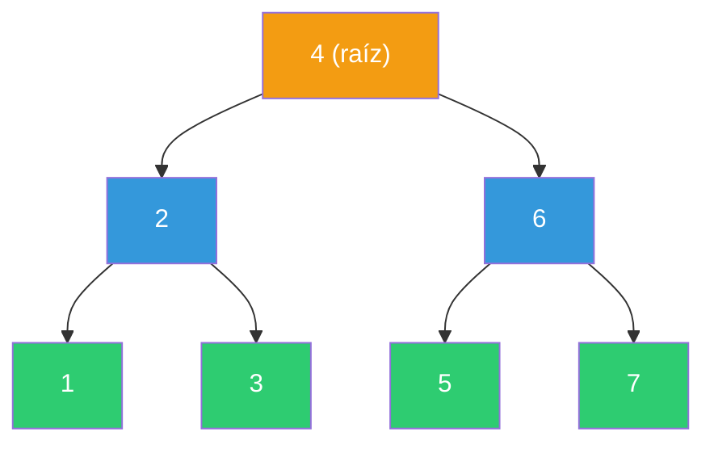
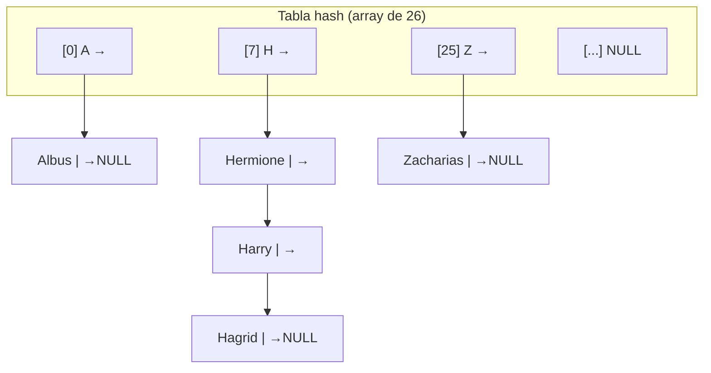

# Clase 5: Estructuras de Datos

En esta semana dejamos los arrays y los algoritmos de ordenamiento para entrar al territorio de las **estructuras de datos dinámicas**: colecciones que pueden crecer o encogerse en tiempo de ejecución, combinando flexibilidad y velocidad de maneras que los arrays estáticos nunca pueden lograr.

---

## Resumen rápido

| Estructura | Acceso | Inserción | Búsqueda | Memoria extra |
|---|---|---|---|---|
| Array | O(1) | O(n) | O(log n) con binaria | Ninguna |
| Lista enlazada | O(n) | O(1) al frente | O(n) lineal | 8 bytes por nodo (puntero) |
| BST balanceado | — | O(log n) | O(log n) | 16 bytes por nodo (2 punteros) |
| Tabla hash | — | O(1) promedio | O(1) promedio | Array + punteros en cada bucket |
| Trie | — | O(k) | O(k) | 26 punteros por nodo (muy sparse) |

> **k** = longitud de la clave (por ejemplo, cantidad de letras de una palabra).

---

## 1. Listas Enlazadas (Linked Lists)

### El problema con los arrays

Un array almacena sus elementos de forma **contigua** en memoria. Eso permite acceso en O(1) (puedes ir directamente a `arr[5]`), pero tiene dos limitaciones graves:

1. Su tamaño debe declararse en tiempo de compilación (o requiere `realloc` para crecer).
2. Insertar en el medio implica desplazar todos los elementos posteriores: O(n).

### La solución: encadenar nodos con punteros

Una lista enlazada reemplaza el bloque contiguo por **nodos dispersos en el heap**, cada uno con dos campos:

- El **dato** (el valor que queremos guardar).
- Un **puntero** al siguiente nodo (o `NULL` si es el último).


### Definición del nodo en C

```c
// Un nodo almacena un entero y un puntero al siguiente nodo
typedef struct node
{
    int numero;           // el dato (puede ser cualquier tipo)
    struct node *siguiente; // puntero al próximo nodo
}
node;
```

La razón de usar `struct node *` dentro de `struct node` es que el typedef aún no está completo cuando declaramos el campo `siguiente`, por eso usamos el nombre completo `struct node`.

### Crear la lista desde cero

```c
#include <stdio.h>
#include <stdlib.h>

int main(void)
{
    // 1. El puntero "cabeza" de la lista; empieza vacía
    node *lista = NULL;

    // 2. Insertar el valor 1 al frente
    node *n = malloc(sizeof(node));
    if (n == NULL)
    {
        return 1; // malloc falló, sin memoria disponible
    }
    n->numero = 1;
    n->siguiente = lista; // el nuevo nodo apunta a la lista anterior
    lista = n;            // ahora la lista empieza en el nuevo nodo

    // 3. Insertar 2 al frente (O(1) — solo manipulamos punteros)
    n = malloc(sizeof(node));
    n->numero = 2;
    n->siguiente = lista;
    lista = n;

    // 4. Insertar 3 al frente
    n = malloc(sizeof(node));
    n->numero = 3;
    n->siguiente = lista;
    lista = n;

    // El orden en memoria será: 3 → 2 → 1 → NULL
    return 0;
}
```

### Recorrer (traversal) la lista

```c
// Imprimir todos los elementos de la lista
void imprimir_lista(node *lista)
{
    // Usamos un puntero temporal para no perder el inicio
    node *temp = lista;

    while (temp != NULL)
    {
        printf("%d\n", temp->numero);
        temp = temp->siguiente; // avanzar al siguiente nodo
    }
}
```

### Liberar la memoria

Cuando terminas con la lista, debes recorrerla y liberar cada nodo con `free`. Si liberas el nodo primero, pierdes el puntero al siguiente.

```c
void liberar_lista(node *lista)
{
    while (lista != NULL)
    {
        node *temp = lista->siguiente; // guardar el siguiente ANTES de liberar
        free(lista);                   // liberar el nodo actual
        lista = temp;                  // avanzar
    }
}
```

### Trade-offs de la lista enlazada

| Ventaja | Desventaja |
|---|---|
| Inserción al frente en O(1) | Acceso por índice en O(n) |
| Tamaño dinámico (crece con malloc) | Sin búsqueda binaria (no hay índices) |
| No necesita bloques contiguos | 8 bytes extra por nodo (puntero) |

---

## 2. Árboles Binarios de Búsqueda (BST)

### De array a árbol

Si tienes el array ordenado `[1, 2, 3, 4, 5, 6, 7]` y aplicas búsqueda binaria repetidamente, estás implícitamente recorriendo un árbol: el elemento del medio (4) es la raíz, los de la izquierda son menores y los de la derecha son mayores. Un BST hace eso **explícito** usando punteros.



**Propiedad BST:** Para cualquier nodo `N`, todos los nodos de su subárbol izquierdo son menores que `N`, y todos los del subárbol derecho son mayores.

### Definición del nodo BST en C

```c
// Nodo de árbol binario de búsqueda
typedef struct nodo_arbol
{
    int numero;                      // el dato
    struct nodo_arbol *izquierda;    // subárbol menor
    struct nodo_arbol *derecha;      // subárbol mayor
}
nodo_arbol;
```

Cada nodo cuesta 4 bytes (int) + 8 bytes (puntero izquierda) + 8 bytes (puntero derecha) = **20 bytes**, versus los 4 bytes de solo guardar el int en un array.

### Búsqueda recursiva en el BST

La recursión es especialmente elegante aquí: el problema se divide solo.

```c
// Retorna true si 'numero' está en el árbol con raíz 'arbol'
bool buscar(int numero, nodo_arbol *arbol)
{
    // Caso base 1: árbol vacío → el número no está
    if (arbol == NULL)
    {
        return false;
    }

    // Caso base 2: encontramos el número
    if (numero == arbol->numero)
    {
        return true;
    }

    // Caso recursivo: buscar en el subárbol correcto
    if (numero < arbol->numero)
    {
        // El número es menor: solo puede estar a la izquierda
        return buscar(numero, arbol->izquierda);
    }
    else
    {
        // El número es mayor: solo puede estar a la derecha
        return buscar(numero, arbol->derecha);
    }
}
```

En un BST **balanceado** (altura ≈ log₂ n), cada llamada recursiva descarta la mitad de los nodos: complejidad O(log n), igual que la búsqueda binaria en arrays.

### El peligro: BST desbalanceado

Si insertas los elementos en orden `1, 2, 3, 4, 5, 6`, el árbol degenera en una lista enlazada disfrazada:

```
1
 \
  2
   \
    3
     \
      4  ← altura = n, búsqueda O(n)
```

Los **árboles balanceados** (AVL, Red-Black) resuelven esto con rotaciones automáticas, pero están fuera del alcance de CS50. Lo importante es entender el concepto.

---

## 3. Tablas Hash (Hash Tables)

### El santo grial: O(1)

Los BST nos dieron O(log n). La búsqueda binaria en arrays también es O(log n). ¿Podemos llegar a O(1) —tiempo constante independiente del tamaño?

Sí, y la clave es **el hashing**.

### ¿Qué es una función hash?

Una función hash toma un valor (una cadena, un número, lo que sea) y devuelve un **índice** dentro de un rango fijo. Es como una fórmula matemática que dice "este valor va al bucket número 7".

```
hash("Albus")    → 0   (primera letra 'A' → índice 0)
hash("Hermione") → 7   (primera letra 'H' → índice 7)
hash("Zacharias")→ 25  (primera letra 'Z' → índice 25)
```

### Estructura de la tabla hash

Una tabla hash es simplemente un **array de punteros a nodos**. Cada posición (bucket) es la cabeza de una lista enlazada.



### Colisiones y encadenamiento (chaining)

El problema surge cuando dos claves producen el mismo índice. Por ejemplo, Hermione, Harry y Hagrid empiezan con 'H' → índice 7. Esto se llama **colisión**.

La solución más común es el **encadenamiento (chaining)**: cada bucket contiene una lista enlazada con todos los elementos que colisionaron ahí.

### Definición en C

```c
// Nodo para la tabla hash (persona con nombre y número)
typedef struct nodo_hash
{
    char nombre[50];           // clave
    char numero[20];           // valor
    struct nodo_hash *siguiente; // para encadenamiento
}
nodo_hash;

// La tabla hash: array de 26 punteros (uno por letra)
#define TAMANO 26
nodo_hash *tabla[TAMANO];

// Función hash simple: primera letra del nombre → índice 0-25
unsigned int hash(const char *palabra)
{
    return toupper(palabra[0]) - 'A'; // 'A' → 0, 'B' → 1, ..., 'Z' → 25
}
```

### Buscar en la tabla hash

```c
// Buscar una persona por nombre; retorna su número o NULL si no existe
char *buscar_persona(const char *nombre)
{
    // 1. Calcular el bucket con la función hash
    unsigned int indice = hash(nombre);

    // 2. Recorrer la lista enlazada en ese bucket
    nodo_hash *cursor = tabla[indice];
    while (cursor != NULL)
    {
        // Comparar ignorando mayúsculas/minúsculas
        if (strcasecmp(cursor->nombre, nombre) == 0)
        {
            return cursor->numero; // encontrado
        }
        cursor = cursor->siguiente;
    }

    return NULL; // no encontrado
}
```

### Complejidad real vs. teórica

- **Teóricamente:** O(n) en el peor caso (todos colisionan en el mismo bucket → una lista enlazada gigante).
- **En la práctica:** Con una buena función hash y suficientes buckets, la distribución es casi uniforme y el tiempo de búsqueda es O(n/k) donde k es el número de buckets. Como k es constante, se simplifica a O(1) en la práctica.

La clave está en la función hash: entre mejor distribuya los valores, menos colisiones habrá.

---

## 4. Tries

### Tiempo verdaderamente constante

Un **trie** (abreviación de "re*trie*val", pronunciado como "try") es un árbol en el que **cada nodo es un array**. Para guardar palabras, cada nodo tiene 26 hijos (uno por letra del alfabeto).

La propiedad clave: el tiempo de búsqueda depende de la **longitud de la clave**, no del número de elementos en la estructura. Si la palabra más larga tiene 50 letras, la búsqueda siempre toma como máximo 50 pasos → O(k) donde k es constante → **O(1) verdadero**.

### Cómo se almacena "Hagrid"

```
Raíz
 └── H [índice 7]
      └── A [índice 0]
           └── G [índice 6]
                └── R [índice 17]
                     └── I [índice 8]
                          └── D [índice 3] ← bool es_fin = true
```

"Harry" comparte el prefijo "HA" con "Hagrid", así que reutiliza esos nodos:

```
Raíz
 └── H
      └── A
           ├── G → R → I → D (fin: Hagrid)
           └── R → R → Y    (fin: Harry)
```

### Definición del nodo en C

```c
#define LETRAS 26

// Nodo del trie: un array de 26 punteros + flag de fin de palabra
typedef struct nodo_trie
{
    struct nodo_trie *hijos[LETRAS]; // puntero para cada letra a-z
    bool es_fin_de_palabra;          // true si aquí termina una palabra válida
}
nodo_trie;
```

Nota: el nombre de la persona **no se guarda** en el nodo; está implícito en el camino desde la raíz hasta ese nodo.

### Insertar una palabra

```c
// Insertar 'palabra' en el trie con raíz 'raiz'
void insertar(nodo_trie *raiz, const char *palabra)
{
    nodo_trie *cursor = raiz;

    for (int i = 0; palabra[i] != '\0'; i++)
    {
        // Convertir letra a índice: 'a' → 0, 'b' → 1, ..., 'z' → 25
        int indice = tolower(palabra[i]) - 'a';

        // Si el hijo no existe, crearlo
        if (cursor->hijos[indice] == NULL)
        {
            cursor->hijos[indice] = calloc(1, sizeof(nodo_trie));
        }

        // Avanzar por el trie
        cursor = cursor->hijos[indice];
    }

    // Marcar el último nodo como fin de palabra
    cursor->es_fin_de_palabra = true;
}
```

### Buscar una palabra

```c
// Retorna true si 'palabra' está en el trie
bool buscar_trie(nodo_trie *raiz, const char *palabra)
{
    nodo_trie *cursor = raiz;

    for (int i = 0; palabra[i] != '\0'; i++)
    {
        int indice = tolower(palabra[i]) - 'a';

        // Si el hijo no existe, la palabra no está en el trie
        if (cursor->hijos[indice] == NULL)
        {
            return false;
        }

        cursor = cursor->hijos[indice];
    }

    // Llegamos al final de la palabra; verificar que sea válida
    return cursor->es_fin_de_palabra;
}
```

### El problema del trie: memoria

Con 26 punteros por nodo, y cada puntero valiendo 8 bytes, cada nodo ocupa al menos **26 × 8 = 208 bytes**, más el bool `es_fin_de_palabra`. Para las tres palabras Hagrid, Harry, Hermione, la mayoría de esos punteros son `NULL`. Es una estructura muy **sparse (dispersa)**.

---

## 5. Tabla Comparativa de Complejidades

| Operación | Array no ordenado | Array ordenado | Lista enlazada | BST balanceado | Tabla hash | Trie |
|---|---|---|---|---|---|---|
| **Buscar** | O(n) | O(log n) | O(n) | O(log n) | O(1)* | O(k) |
| **Insertar** | O(1) al final | O(n) por desplazamiento | O(1) al frente | O(log n) | O(1)* | O(k) |
| **Eliminar** | O(n) | O(n) | O(n) buscar + O(1) desconectar | O(log n) | O(1)* | O(k) |
| **Memoria extra** | Ninguna | Ninguna | 8 bytes/nodo | 16 bytes/nodo | Depende | 208 bytes/nodo |

> **\*** O(1) en la práctica con buena función hash; teóricamente O(n) en el peor caso.
> **k** = longitud de la clave (tratada como constante en la práctica).

### La tensión tiempo-espacio

Casi siempre que quieres ganar velocidad, pagas con memoria. Y si quieres ahorrar memoria, pagas con tiempo. Esto es el **trade-off** fundamental de las estructuras de datos:

- Los **arrays** son memoria perfecta pero inflexibles.
- Las **listas enlazadas** son flexibles pero lentas en búsqueda.
- Los **BST** recuperan la velocidad logarítmica y añaden flexibilidad.
- Las **tablas hash** acercan la búsqueda a O(1) a costo de memoria extra y sin orden.
- Los **tries** logran O(1) verdadero pero usan cantidades masivas de memoria.

---

## 6. Problemas de la Semana

### Inheritance (Herencia Genética)

En este problema simulas la herencia de grupos sanguíneos generación a generación. Cada persona tiene dos alelos de sangre heredados de sus padres.

La estructura que necesitas:

```c
// Representa a una persona con sus genes de grupo sanguíneo
typedef struct persona
{
    struct persona *padres[2]; // punteros a los dos padres (NULL si son bisabuelos)
    char alelos[2];            // 'A', 'B', u 'O'
}
persona;
```

El patrón central es recursivo: crear un árbol de personas de n generaciones hacia atrás (la bisabuela/o tiene padres `NULL`), asignar alelos al azar a los más viejos, y luego propagar hacia abajo eligiendo un alelo de cada padre.

### Speller (Corrector Ortográfico)

En este problema implementas un corrector ortográfico que carga un diccionario de ~143,000 palabras y verifica si cada palabra de un texto existe en él.

Tu misión es implementar cuatro funciones en `dictionary.c`:

```c
bool check(const char *word);       // ¿está 'word' en el diccionario?
bool load(const char *dictionary);  // cargar el archivo del diccionario
unsigned int size(void);            // ¿cuántas palabras hay?
bool unload(void);                  // liberar toda la memoria
```

La elección de estructura de datos es tuya. Una **tabla hash** con buen número de buckets (por ejemplo, 65,536) puede resolver el problema eficientemente. Un **trie** también funciona y garantiza O(k) en búsqueda. La trampa es que la solución en Python implementada con el tipo `set` incorporado tarda ~2.4 segundos, mientras que una implementación en C bien diseñada puede tardar menos de 0.4 segundos —ahí ves el valor de gestionar la memoria manualmente.
