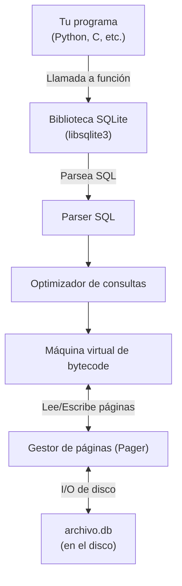
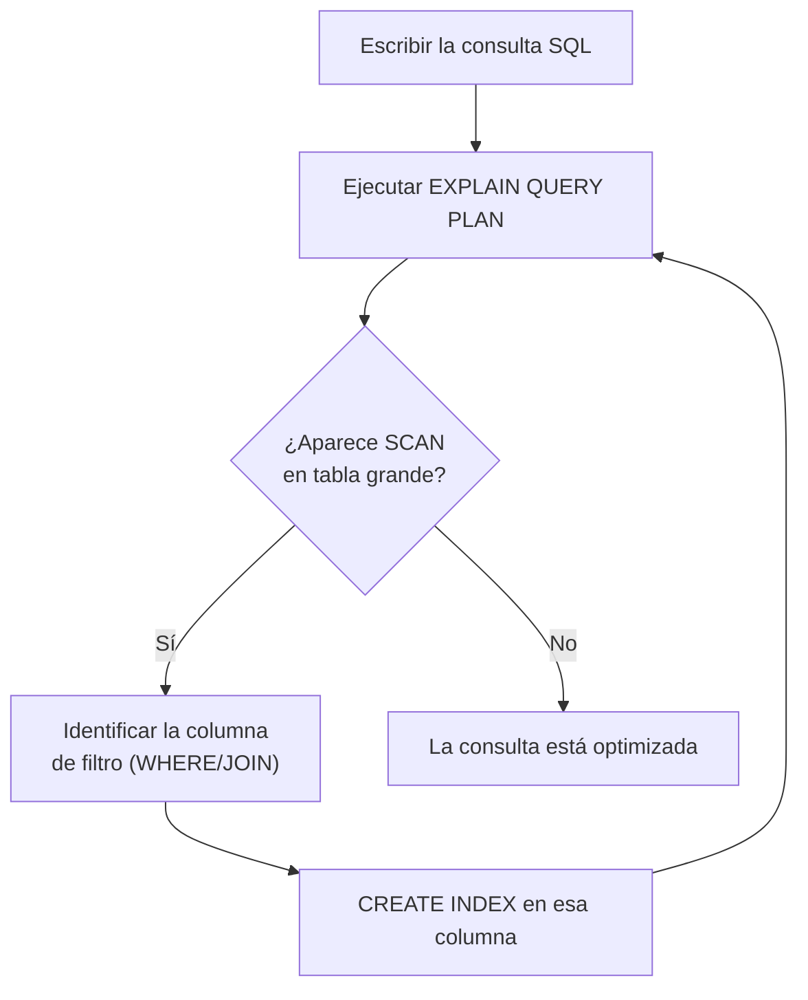

# Material Complementario: Cómo Piensa una Base de Datos

Este material profundiza en los mecanismos internos de SQLite: cómo almacena los datos, por qué los índices aceleran las búsquedas, y cómo puedes inspeccionar el plan de ejecución de tus consultas para identificar cuellos de botella.

---

## 1. El motor SQLite por dentro

SQLite es diferente de la mayoría de los sistemas de bases de datos. No requiere un servidor separado — es simplemente una **biblioteca** que tu programa incluye, y todos los datos se guardan en **un único archivo** en el disco (por ejemplo, `peliculas.db`).

### Arquitectura simplificada de SQLite



### Páginas: la unidad de almacenamiento

SQLite almacena todo en **páginas** de tamaño fijo (por defecto 4096 bytes = 4 KB). Cada tabla y cada índice ocupa un conjunto de páginas en el archivo `.db`.

Cuando haces `SELECT * FROM peliculas`, SQLite no carga todo el archivo en memoria a la vez. Lee páginas del disco según las necesita, y las guarda en una **caché de páginas** (page cache) para reutilizarlas si la misma página se necesita pronto.

### Árboles B: la estructura interna de tablas e índices

Internamente, cada tabla se organiza como un **árbol B** (B-tree). A diferencia de un árbol binario (donde cada nodo tiene como máximo 2 hijos), un árbol B puede tener muchos hijos por nodo, lo que lo mantiene **muy poco profundo** incluso con millones de elementos.

```
Árbol binario con 7 elementos → profundidad 3:
           4
          / \
         2   6
        / \ / \
       1  3 5  7

Árbol B con branching factor 3 → profundidad 2 para los mismos datos:
          [3, 5]
         /  |   \
       [1,2] [4] [6,7]
```

La ventaja: para encontrar un elemento en un árbol B con millones de nodos, solo necesitas descender 3 o 4 niveles. Cada nivel es una lectura de disco (una página). Esto es lo que hace que los índices sean tan rápidos.

### Transacciones y el archivo WAL

Cuando modificas datos (INSERT, UPDATE, DELETE), SQLite usa un mecanismo llamado **Write-Ahead Log (WAL)** para garantizar que:

1. Si el programa se cierra a mitad de una escritura, la base de datos **no queda corrupta**.
2. Múltiples lectores pueden acceder a la base de datos al mismo tiempo que alguien escribe.

Por defecto, una operación como `db.execute("INSERT ...")` es automáticamente una transacción atómica: o se completa entera, o no ocurre nada.

---

## 2. Por qué un índice acelera las búsquedas

### La analogía del libro

Imagina que tienes un libro de 1000 páginas sobre películas, ordenado por **orden de publicación** (no alfabéticamente). Si buscas la película "The Office", tienes que leer página por página hasta encontrarla — en el peor caso, lees las 1000 páginas. Esto es una **búsqueda lineal**: O(n).

Ahora imagina que el libro tiene un **índice alfabético** al final:

```
...
T
  The Crown → pág. 423
  The Mandalorian → pág. 671
  The Office → pág. 234
  The Wire → pág. 891
...
```

Con el índice, vas directo a "T", encuentras "The Office" y saltas a la página 234. Solo leíste unas pocas entradas del índice + 1 página del libro. Esto es una **búsqueda logarítmica**: O(log n).

### Cómo funciona en SQLite

Sin índice, una consulta como:

```sql
SELECT * FROM peliculas WHERE titulo = 'The Office';
```

...obliga a SQLite a hacer un **table scan**: leer cada fila de la tabla `peliculas` y comparar el título. Con 200,000 películas, eso son 200,000 comparaciones.

Con un índice en la columna `titulo`:

```sql
CREATE INDEX indice_titulo ON peliculas (titulo);
```

SQLite construye un árbol B separado cuyas hojas contienen pares `(valor_de_titulo, rowid)`. Para encontrar "The Office", desciende por el árbol B en unos pocos pasos y obtiene directamente el `rowid` (número de fila), con el que accede a la página exacta de la tabla. Unas pocas operaciones en lugar de 200,000.

### El costo oculto de los índices

Los índices no son gratuitos. Cada vez que haces un INSERT, UPDATE o DELETE, SQLite debe:

1. Modificar la tabla principal.
2. Actualizar **cada índice** que afecte a las columnas modificadas.

Si tienes 5 índices en una tabla y haces 1,000,000 de inserciones, cada inserción actualiza 6 estructuras (la tabla + 5 índices). Para cargas masivas de escritura, a veces conviene eliminar los índices temporalmente, cargar los datos, y volver a crearlos.

### Cuándo crear un índice

Crea índices en columnas que:

- Aparecen frecuentemente en cláusulas `WHERE`
- Son usadas en `JOIN` (especialmente las claves foráneas)
- Son usadas en `ORDER BY` con tablas grandes
- Tienen alta **cardinalidad** (muchos valores distintos — por ejemplo, `email` tiene alta cardinalidad; una columna `activo` con solo `true`/`false` tiene baja cardinalidad)

No crees índices en columnas que:

- Raramente aparecen en consultas
- Tienen muy pocos valores distintos (baja cardinalidad)
- Pertenecen a tablas muy pequeñas (el overhead del índice no vale la pena)

---

## 3. EXPLAIN QUERY PLAN en SQLite

SQLite te permite ver exactamente **cómo planea ejecutar una consulta** antes de ejecutarla. Esto se llama el **plan de consulta** (query plan).

### Sintaxis

```sql
EXPLAIN QUERY PLAN
SELECT ...;
```

### Ejemplo: sin índice

```sql
-- Primero, sin índice
EXPLAIN QUERY PLAN
SELECT * FROM peliculas WHERE titulo = 'The Office';
```

Resultado típico:

```
QUERY PLAN
└── SCAN peliculas
```

`SCAN` significa que SQLite va a leer **todas** las filas de la tabla. En una tabla de 200,000 filas, eso es un problema.

### Ejemplo: con índice

```sql
-- Crear el índice
CREATE INDEX indice_titulo ON peliculas (titulo);

-- Consultar de nuevo
EXPLAIN QUERY PLAN
SELECT * FROM peliculas WHERE titulo = 'The Office';
```

Resultado:

```
QUERY PLAN
└── SEARCH peliculas USING INDEX indice_titulo (titulo=?)
```

`SEARCH ... USING INDEX` confirma que SQLite está usando el árbol B del índice para ir directamente a las filas relevantes.

### Ejemplo con JOIN

```sql
EXPLAIN QUERY PLAN
SELECT peliculas.titulo, calificaciones.calificacion
FROM peliculas
JOIN calificaciones ON peliculas.id = calificaciones.pelicula_id
WHERE peliculas.titulo = 'The Office';
```

Resultado con índices:

```
QUERY PLAN
├── SEARCH peliculas USING INDEX indice_titulo (titulo=?)
└── SEARCH calificaciones USING INDEX sqlite_autoindex_calificaciones_1 (pelicula_id=?)
```

Aquí ves que SQLite usa dos índices: uno para encontrar "The Office" en la tabla `peliculas`, y otro para encontrar su calificación en la tabla `calificaciones` sin escanear todas las filas.

### Cómo interpretar el plan

| Texto en el plan | Qué significa |
|---|---|
| `SCAN tabla` | Búsqueda lineal — revisar todas las filas (lento en tablas grandes) |
| `SEARCH tabla USING INDEX nombre` | Búsqueda por índice — rápido |
| `SEARCH tabla USING COVERING INDEX` | El índice contiene todas las columnas necesarias — aún más rápido |
| `USE TEMP B-TREE FOR ORDER BY` | SQLite crea un árbol B temporal para ordenar — considera un índice en la columna ORDER BY |

### Flujo de trabajo recomendado para optimizar consultas



### Ejemplo práctico completo

Supón que la siguiente consulta es lenta:

```sql
SELECT personas.nombre
FROM personas
JOIN estrellas ON personas.id = estrellas.persona_id
JOIN peliculas ON estrellas.pelicula_id = peliculas.id
WHERE peliculas.titulo = 'Inception';
```

Ejecutas el plan:

```
QUERY PLAN
├── SCAN peliculas
├── SCAN estrellas
└── SEARCH personas USING INTEGER PRIMARY KEY (rowid=?)
```

Ves dos `SCAN`. Solución:

```sql
-- Índice en el título de películas
CREATE INDEX idx_peliculas_titulo ON peliculas (titulo);

-- Índice en la clave foránea de estrellas (muy importante para JOINs)
CREATE INDEX idx_estrellas_pelicula ON estrellas (pelicula_id);
```

Después de crear los índices, el plan debería mostrar `SEARCH` para todas las tablas.

---

## 4. Tipos de datos en SQLite

SQLite es inusualmente flexible con los tipos de datos — usa un sistema llamado **tipado dinámico** (o "type affinity"). A diferencia de otros sistemas, SQLite en realidad almacena el valor en el formato más eficiente posible, sin importar exactamente cómo se declaró la columna.

Los cinco tipos de almacenamiento en SQLite son:

| Tipo | Descripción | Ejemplo |
|---|---|---|
| `NULL` | Valor ausente o desconocido | — |
| `INTEGER` | Entero de 1, 2, 3, 4, 6 u 8 bytes | `42`, `-7` |
| `REAL` | Número de punto flotante de 8 bytes | `3.14`, `9.2` |
| `TEXT` | Cadena de texto UTF-8, UTF-16 o ASCII | `'hola'` |
| `BLOB` | Datos binarios arbitrarios | archivos, imágenes |

Cuando declara columnas como `INTEGER`, `TEXT NOT NULL`, o `NUMERIC`, SQLite usa esas declaraciones como **preferencias** (afinity), pero no las impone estrictamente. Esto es diferente de PostgreSQL o MySQL, que son estrictos con los tipos.

### Restricciones (constraints) comunes

| Restricción | Significado |
|---|---|
| `NOT NULL` | La columna no puede estar vacía |
| `UNIQUE` | No pueden existir dos filas con el mismo valor en esta columna |
| `PRIMARY KEY` | Identificador único de la fila (implica NOT NULL + UNIQUE) |
| `FOREIGN KEY` | Referencia a la clave primaria de otra tabla |
| `DEFAULT valor` | Valor que se usa si no se especifica uno al insertar |
| `CHECK (condicion)` | Valida que el valor cumpla una condición |

Ejemplo de tabla bien diseñada:

```sql
CREATE TABLE usuarios (
    id       INTEGER PRIMARY KEY,    -- autoincremento implícito
    email    TEXT NOT NULL UNIQUE,   -- obligatorio y sin duplicados
    nombre   TEXT NOT NULL,
    edad     INTEGER CHECK(edad >= 0 AND edad < 130),
    activo   INTEGER DEFAULT 1       -- 1 = activo por defecto
);
```
