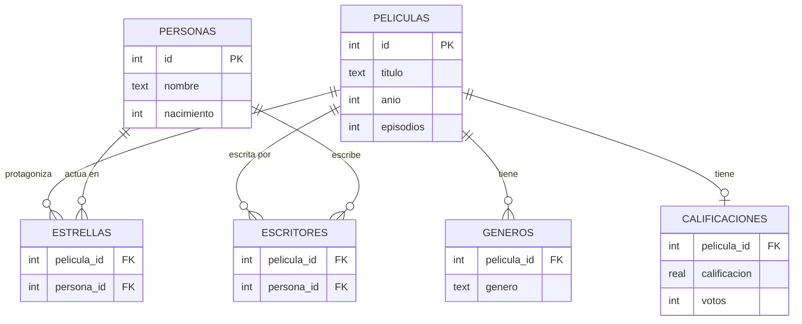
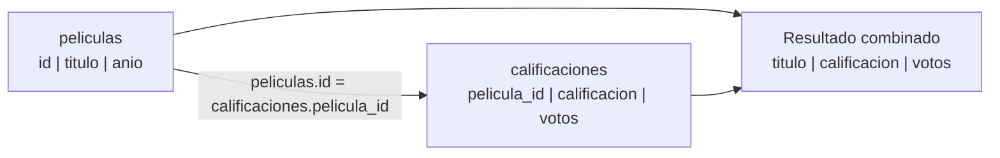
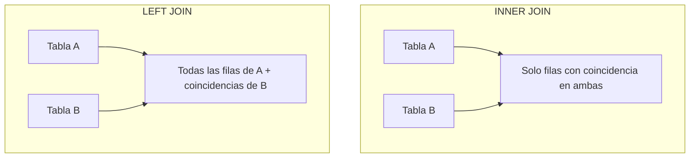
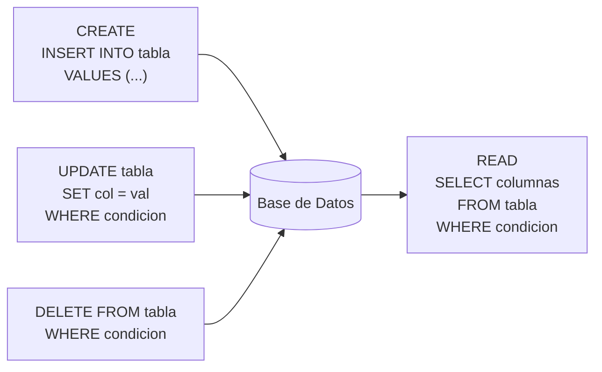

# Clase 7: SQL y Bases de Datos Relacionales

Bienvenido a la Semana 7 de LocalCode (CS50x). Esta semana damos un salto importante: dejamos de almacenar datos en variables de memoria o archivos de texto plano, y aprendemos a usar **bases de datos relacionales** con **SQL** (Structured Query Language). SQL es el lenguaje estándar para crear, leer, actualizar y eliminar datos en aplicaciones web, móviles y sistemas de análisis de datos.

---

## Resumen rápido

| Concepto | En pocas palabras |
|---|---|
| Base de datos relacional | Colección organizada de tablas con filas y columnas |
| SQLite | Motor de base de datos ligero, ideal para aprender y aplicaciones pequeñas |
| CRUD | Create, Read, Update, Delete — las cuatro operaciones fundamentales |
| SELECT | Consultar (leer) datos de una tabla |
| WHERE | Filtrar filas según una condición |
| JOIN | Combinar datos de dos o más tablas |
| Índice | Estructura que acelera las búsquedas en una columna |
| Inyección SQL | Ataque que inserta código malicioso en una consulta |

---

## 1. ¿Qué es una base de datos relacional?

Cuando tienes poca información, un archivo CSV o incluso variables en memoria pueden ser suficientes. Pero cuando la cantidad de datos crece — piensa en millones de canciones, películas o usuarios — necesitas algo más poderoso y organizado.

Una **base de datos relacional** almacena datos en **tablas**, que son muy similares a las hojas de cálculo que conoces (Google Sheets, Excel). La diferencia clave es que puedes tener **múltiples tablas** y establecer **relaciones** entre ellas, de ahí el nombre.

Los sistemas de bases de datos relacionales más conocidos son:
- **SQLite** — ligero, sin servidor, ideal para aprender y apps móviles
- **MySQL / MariaDB** — muy usado en la web
- **PostgreSQL** — robusto y de código abierto
- **Microsoft SQL Server** — popular en entornos empresariales
- **Oracle** — usado en grandes corporaciones

Todos hablan (con variaciones menores) el mismo lenguaje: **SQL**.

### ¿Por qué no seguir usando CSV?

Piensa en el problema que tenías con Python y archivos CSV para analizar datos de favoritos. Para contar cuántos estudiantes prefieren C, necesitabas escribir 15 líneas de código. Con SQL, la misma pregunta se responde en **una sola línea**:

```sql
SELECT COUNT(*) FROM favoritos WHERE idioma = 'C';
```

SQL es declarativo: describes **qué** quieres, no **cómo** obtenerlo paso a paso.

---

## 2. Tablas y relaciones

### La anatomía de una tabla

Una tabla tiene:
- Un **nombre** (por ejemplo, `peliculas`)
- **Columnas** (también llamadas campos o atributos) — definen la estructura
- **Filas** (también llamadas registros o tuplas) — contienen los datos reales

```
Tabla: peliculas
┌────┬──────────────────────┬──────┬──────────┐
│ id │ titulo               │ anio │ episodios│
├────┼──────────────────────┼──────┼──────────┤
│  1 │ Breaking Bad         │ 2008 │      62  │
│  2 │ The Office           │ 2005 │     188  │
│  3 │ Stranger Things      │ 2016 │      42  │
└────┴──────────────────────┴──────┴──────────┘
```

### Clave primaria (PRIMARY KEY)

Cada tabla debe tener una columna que **identifique de forma única cada fila**. Esta columna se llama **clave primaria** (primary key). En el ejemplo anterior, `id` es la clave primaria: no puede haber dos películas con el mismo `id`.

La clave primaria:
- Es única para cada fila
- No puede ser `NULL` (vacía)
- Generalmente es un número entero que se incrementa automáticamente

### Clave foránea (FOREIGN KEY)

Cuando dos tablas se relacionan, una de ellas guarda la clave primaria de la otra. Esa referencia se llama **clave foránea** (foreign key).

Por ejemplo, si tenemos una tabla de actores y queremos saber en qué películas actuó cada uno:

```
Tabla: actores
┌────┬──────────────────┬──────────┐
│ id │ nombre           │ nacimiento│
├────┼──────────────────┼──────────┤
│  1 │ Bryan Cranston   │     1956 │
│  2 │ Steve Carell     │     1962 │
└────┴──────────────────┴──────────┘

Tabla: participaciones
┌────────────┬───────────┐
│ pelicula_id│ actor_id  │    ← ambas son claves foráneas
├────────────┼───────────┤
│          1 │         1 │    (Breaking Bad → Bryan Cranston)
│          2 │         2 │    (The Office → Steve Carell)
└────────────┴───────────┘
```

### Tipos de relaciones

| Tipo | Descripción | Ejemplo |
|---|---|---|
| Uno a uno | Una fila de A corresponde a exactamente una de B | Persona ↔ Pasaporte |
| Uno a muchos | Una fila de A corresponde a varias de B | Director → muchas Películas |
| Muchos a muchos | Varias de A se relacionan con varias de B | Actores ↔ Películas |

Las relaciones muchos a muchos requieren una **tabla intermedia** (como `participaciones` arriba).

### Diagrama de la base de datos de películas (IMDB)



---

## 3. SELECT básico

`SELECT` es el comando más importante de SQL. Permite **leer** datos de una o más tablas.

### Sintaxis general

```sql
SELECT columna1, columna2, ...
FROM nombre_tabla;
```

### Seleccionar todas las columnas

El asterisco `*` es un comodín que significa "todas las columnas":

```sql
-- Traer todos los datos de la tabla peliculas
SELECT * FROM peliculas;
```

### Seleccionar columnas específicas

```sql
-- Solo el título y el año
SELECT titulo, anio FROM peliculas;
```

### Funciones de agregación

SQL incluye funciones útiles que operan sobre conjuntos de datos:

| Función | Descripción |
|---|---|
| `COUNT(*)` | Cuenta el número de filas |
| `AVG(columna)` | Calcula el promedio |
| `MAX(columna)` | Obtiene el valor máximo |
| `MIN(columna)` | Obtiene el valor mínimo |
| `SUM(columna)` | Suma los valores |

```sql
-- ¿Cuántas películas hay en la base de datos?
SELECT COUNT(*) FROM peliculas;

-- ¿Cuántos géneros distintos existen?
SELECT COUNT(DISTINCT genero) FROM generos;

-- Alias para renombrar la columna de resultado
SELECT COUNT(*) AS total FROM peliculas;
```

### DISTINCT — valores únicos

```sql
-- ¿Qué géneros existen? (sin repetir)
SELECT DISTINCT genero FROM generos;
```

### GROUP BY — agrupar resultados

```sql
-- Contar películas por género
SELECT genero, COUNT(*) AS cantidad
FROM generos
GROUP BY genero;

-- Ordenar de mayor a menor
SELECT genero, COUNT(*) AS cantidad
FROM generos
GROUP BY genero
ORDER BY cantidad DESC;
```

---

## 4. WHERE y filtros

La cláusula `WHERE` funciona como un `if` que filtra las filas que cumplen una condición.

```sql
-- Películas estrenadas después del 2000
SELECT titulo, anio
FROM peliculas
WHERE anio > 2000;

-- Una película específica
SELECT * FROM peliculas
WHERE titulo = 'The Office';
```

### Operadores de comparación

| Operador | Significado |
|---|---|
| `=` | Igual |
| `<>` o `!=` | Distinto |
| `>` | Mayor que |
| `>=` | Mayor o igual |
| `<` | Menor que |
| `<=` | Menor o igual |

### Operadores lógicos: AND, OR, NOT

```sql
-- Comedias estrenadas antes de 2010
SELECT titulo, anio
FROM peliculas
WHERE genero = 'Comedy' AND anio < 2010;

-- Películas de 2005 o 2010
SELECT titulo
FROM peliculas
WHERE anio = 2005 OR anio = 2010;
```

### LIKE — búsqueda por patrón

El operador `LIKE` permite buscar cadenas de texto con coincidencia parcial. El símbolo `%` representa cero o más caracteres:

```sql
-- Películas cuyo título empieza con "The"
SELECT titulo FROM peliculas
WHERE titulo LIKE 'The%';

-- Títulos que contienen la palabra "Office"
SELECT titulo FROM peliculas
WHERE titulo LIKE '%Office%';

-- Buscar artistas cuyo nombre empieza con "S" y tiene "C" después
SELECT * FROM personas
WHERE nombre LIKE 'S% C%';
```

> **Nota:** En SQLite, las cadenas de texto se escriben con comillas simples: `'The Office'`, no `"The Office"`.

---

## 5. ORDER BY y LIMIT

### ORDER BY — ordenar resultados

```sql
-- Películas ordenadas por año, del más antiguo al más nuevo
SELECT titulo, anio
FROM peliculas
ORDER BY anio ASC;   -- ASC = ascendente (es el valor por defecto)

-- Del más nuevo al más antiguo
SELECT titulo, anio
FROM peliculas
ORDER BY anio DESC;  -- DESC = descendente

-- Ordenar por múltiples columnas
SELECT titulo, anio, calificacion
FROM peliculas
ORDER BY calificacion DESC, titulo ASC;
```

### LIMIT — limitar resultados

Cuando tienes millones de filas, `LIMIT` te salva la vida en el desarrollo:

```sql
-- Las 10 películas mejor calificadas
SELECT titulo, calificacion
FROM calificaciones
JOIN peliculas ON calificaciones.pelicula_id = peliculas.id
ORDER BY calificacion DESC
LIMIT 10;

-- Solo el número 1
SELECT titulo FROM peliculas
ORDER BY anio DESC
LIMIT 1;
```

### Combinación práctica: top 5 géneros más populares

```sql
SELECT genero, COUNT(*) AS cantidad
FROM generos
GROUP BY genero
ORDER BY cantidad DESC
LIMIT 5;
```

---

## 6. JOIN — combinar tablas

`JOIN` es la característica más poderosa de las bases de datos relacionales. Permite combinar datos de dos o más tablas basándose en una columna en común.

### ¿Por qué necesitas JOIN?

Supón que quieres saber la calificación de "The Office". La tabla `peliculas` tiene el título pero no la calificación. La tabla `calificaciones` tiene la calificación pero solo guarda el `id` de la película, no el título. `JOIN` las une:



### INNER JOIN

El `INNER JOIN` (o simplemente `JOIN`) devuelve solo las filas que tienen coincidencia en **ambas** tablas:

```sql
-- Películas con su calificación
SELECT peliculas.titulo, calificaciones.calificacion, calificaciones.votos
FROM peliculas
JOIN calificaciones ON peliculas.id = calificaciones.pelicula_id
WHERE peliculas.titulo = 'The Office';
```

### Ejemplo con tres tablas

¿En qué películas actúa un artista específico?

```sql
-- Todas las películas de Bryan Cranston
SELECT peliculas.titulo
FROM personas
JOIN estrellas ON personas.id = estrellas.persona_id
JOIN peliculas ON estrellas.pelicula_id = peliculas.id
WHERE personas.nombre = 'Bryan Cranston'
ORDER BY peliculas.titulo;
```

### LEFT JOIN

El `LEFT JOIN` devuelve **todas** las filas de la tabla izquierda, aunque no tengan coincidencia en la tabla derecha. Las columnas de la tabla derecha aparecen como `NULL` cuando no hay coincidencia:

```sql
-- Todas las películas, con su calificación si existe (o NULL si no tiene)
SELECT peliculas.titulo, calificaciones.calificacion
FROM peliculas
LEFT JOIN calificaciones ON peliculas.id = calificaciones.pelicula_id;
```

### Diferencia entre INNER JOIN y LEFT JOIN



| | INNER JOIN | LEFT JOIN |
|---|---|---|
| Filas de la izq. sin coincidencia | No aparecen | Aparecen con NULL |
| Filas de la der. sin coincidencia | No aparecen | No aparecen |
| Uso típico | Datos relacionados garantizados | Incluir todos aunque no haya relación |

### Subconsultas (consultas anidadas)

También puedes anidar consultas dentro de otras, como paréntesis en matemáticas:

```sql
-- Títulos de todas las películas de comedia
SELECT titulo
FROM peliculas
WHERE id IN (
    SELECT pelicula_id FROM generos
    WHERE genero = 'Comedy'
)
ORDER BY titulo
LIMIT 10;
```

---

## 7. INSERT, UPDATE, DELETE

Estas tres instrucciones corresponden a las operaciones de **escritura** del CRUD.

### INSERT — insertar datos

```sql
-- Sintaxis general
INSERT INTO nombre_tabla (columna1, columna2, ...)
VALUES (valor1, valor2, ...);

-- Ejemplo: agregar una película
INSERT INTO peliculas (titulo, anio, episodios)
VALUES ('House of the Dragon', 2022, 18);

-- Insertar sin especificar columnas (debes dar valores para TODAS)
INSERT INTO generos
VALUES (12345, 'Fantasy');
```

> **Importante:** Si hay columnas marcadas como `NOT NULL` y no las incluyes, SQL lanzará un error.

### UPDATE — actualizar datos

```sql
-- Sintaxis general
UPDATE nombre_tabla
SET columna1 = valor1, columna2 = valor2
WHERE condicion;

-- Ejemplo: corregir el año de una película
UPDATE peliculas
SET anio = 2023
WHERE titulo = 'House of the Dragon';
```

> **Advertencia critica:** Si omites el `WHERE`, actualizas **todas** las filas de la tabla. Esto ha causado desastres reales en producción. Siempre revisa tu condición antes de ejecutar.

```sql
-- PELIGROSO: actualiza TODOS los títulos
UPDATE peliculas SET titulo = 'Sin título';

-- CORRECTO: solo actualiza la fila con id = 5
UPDATE peliculas SET titulo = 'House of the Dragon' WHERE id = 5;
```

### DELETE — eliminar datos

```sql
-- Eliminar filas específicas
DELETE FROM peliculas
WHERE titulo = 'House of the Dragon';

-- PELIGROSO: elimina TODAS las filas
DELETE FROM peliculas;  -- ¡sin WHERE borra todo!
```

### DROP vs DELETE

| Comando | Efecto |
|---|---|
| `DELETE FROM tabla WHERE ...` | Elimina filas (datos) |
| `DELETE FROM tabla` | Elimina todas las filas (datos), conserva la estructura |
| `DROP TABLE tabla` | Elimina la tabla completa, incluyendo su estructura |

---

## 8. Índices

Imagina que tienes la base de datos de IMDB con millones de películas y buscas "The Office". Sin un índice, la base de datos tiene que revisar **cada fila** de la tabla (búsqueda lineal), lo cual puede tardar segundos.

Un **índice** es una estructura de datos (generalmente un árbol B) que la base de datos construye internamente para acelerar las búsquedas en una columna. Es exactamente como el índice al final de un libro: en lugar de leer todo el libro para encontrar una palabra, consultas el índice y vas directamente a la página.

### Crear un índice

```sql
-- Crear un índice en la columna titulo de la tabla peliculas
CREATE INDEX indice_titulo ON peliculas (titulo);
```

### Impacto en el rendimiento

Sin índice, una búsqueda por título puede tomar 0.035 segundos. Con el índice, la misma búsqueda tarda 0.001 segundos — **35 veces más rápido**.

Con millones de usuarios, esos milisegundos marcan la diferencia entre una app fluida y una que se siente lenta.

### El costo de los índices

Los índices no son gratuitos:
- **Ocupan espacio adicional** en disco y memoria
- **Ralentizan las escrituras** (INSERT, UPDATE, DELETE), porque la base de datos debe actualizar el índice también

Por eso no debes indexar todas las columnas. Indexa solo aquellas que:
- Usas frecuentemente en `WHERE`, `JOIN` o `ORDER BY`
- Tienen alta cardinalidad (muchos valores distintos, como `titulo` o `email`)

### EXPLAIN QUERY PLAN

En SQLite puedes ver si una consulta usa un índice:

```sql
EXPLAIN QUERY PLAN
SELECT * FROM peliculas WHERE titulo = 'The Office';
```

Si ves `SEARCH peliculas USING INDEX indice_titulo`, el índice se está usando. Si ves `SCAN peliculas`, está haciendo búsqueda lineal.

---

## 9. Inyección SQL

La inyección SQL (SQL injection) es uno de los ataques más comunes y peligrosos en aplicaciones web. Ocurre cuando un atacante logra insertar código SQL malicioso dentro de una consulta legítima.

### El problema: construir consultas con concatenación

Supón que tienes un sistema de login que verifica usuario y contraseña:

```python
# CODIGO VULNERABLE - NO hagas esto
usuario = input("Usuario: ")
contrasena = input("Contraseña: ")

# Construir la consulta concatenando texto directamente
consulta = f"SELECT * FROM usuarios WHERE usuario = '{usuario}' AND contrasena = '{contrasena}'"
db.execute(consulta)
```

Un atacante puede escribir como usuario:

```
admin'--
```

La consulta resultante sería:

```sql
SELECT * FROM usuarios WHERE usuario = 'admin'--' AND contrasena = 'cualquier cosa'
```

En SQL, `--` es un comentario: todo lo que viene después se ignora. El atacante inicia sesión **sin saber la contraseña**.

### Casos aún más destructivos

```sql
-- El atacante escribe: '; DROP TABLE usuarios; --
SELECT * FROM usuarios WHERE usuario = ''; DROP TABLE usuarios; --'
```

Esto podría eliminar toda la tabla de usuarios.

### La solución: parámetros con marcadores de posición

En lugar de insertar los valores directamente en el texto, usa **marcadores de posición** (placeholders). La biblioteca SQL se encarga de escapar (sanitizar) los caracteres peligrosos:

```python
# CODIGO SEGURO - siempre usa placeholders
usuario = input("Usuario: ")
contrasena = input("Contraseña: ")

# El ? es el placeholder — la biblioteca escapa los valores automáticamente
filas = db.execute(
    "SELECT * FROM usuarios WHERE usuario = ? AND contrasena = ?",
    usuario, contrasena
)
```

Con este enfoque, aunque el atacante escriba `admin'--`, el texto se trata como un literal y no como código SQL.

### Regla de oro

> **Nunca construyas consultas SQL con f-strings o concatenación de cadenas cuando incluyes input del usuario. Usa siempre placeholders (`?` en SQLite).**

---

## 10. SQL en Python

En el mundo real, combinas Python y SQL. Python maneja la lógica del programa y la interfaz; SQL se encarga del almacenamiento y consulta de datos.

```python
from cs50 import SQL

# Abrir (o crear) la base de datos
db = SQL("sqlite:///mi_base.db")

# Consultar datos
filas = db.execute("SELECT titulo, anio FROM peliculas ORDER BY anio DESC LIMIT 5")

for fila in filas:
    print(f"{fila['titulo']} ({fila['anio']})")
```

### Lo que devuelve db.execute

- Para `SELECT`: una **lista de diccionarios**, donde cada diccionario es una fila y las claves son los nombres de las columnas.
- Para `INSERT`/`UPDATE`/`DELETE`: no devuelve filas, pero opera sobre la base de datos.

```python
# SELECT COUNT devuelve una lista con un diccionario
resultado = db.execute("SELECT COUNT(*) AS total FROM peliculas")
total = resultado[0]["total"]
print(f"Total de películas: {total}")
```

### Insertar datos desde Python

```python
titulo = input("Título: ")
anio = int(input("Año: "))

db.execute(
    "INSERT INTO peliculas (titulo, anio) VALUES (?, ?)",
    titulo, anio
)
```

---

## Resumen visual del flujo CRUD



---

## Problemas de la semana

Esta semana trabajarás con tres conjuntos de datos reales:

### Songs (datos de Spotify)
Consultas sobre canciones, artistas y álbumes. Practicarás `SELECT`, `WHERE`, `ORDER BY`, `LIMIT` y funciones de agregación.

### Movies (IMDB)
Base de datos con seis tablas relacionadas: personas, películas, géneros, calificaciones, estrellas y escritores. Practicarás `JOIN` y subconsultas para responder preguntas como "¿en qué películas actúa tal persona?"

### Fiftyville
Un misterio de detectives: debes usar SQL para rastrear a un sospechoso analizando registros de llamadas telefónicas, transacciones bancarias y más. Cada pista te lleva a la siguiente consulta.
