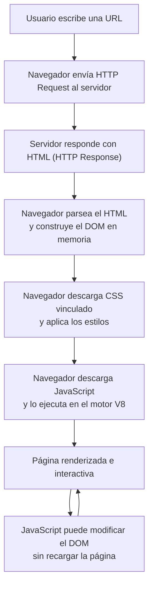
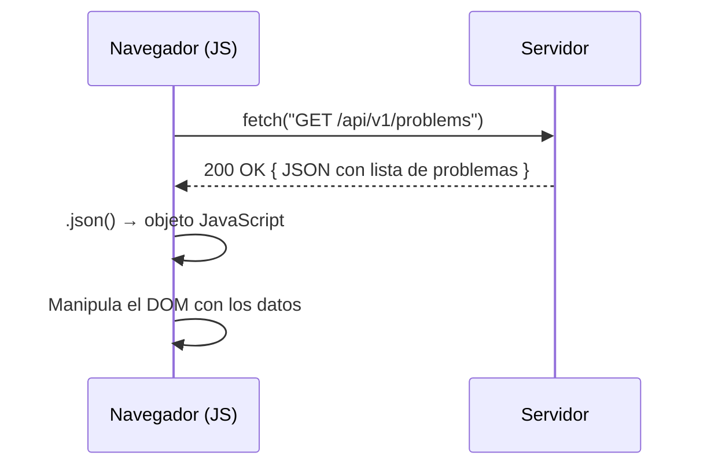

# Clase 8: HTML, CSS y JavaScript

Bienvenido a la Semana 8 de LocalCode. Esta es la clase donde el curso da un giro hacia la web. Hasta ahora escribiste código que se ejecuta en un servidor o en tu terminal. A partir de hoy, escribirás código que el **navegador** descarga y ejecuta en la computadora del usuario. Las tres tecnologías centrales son HTML (estructura), CSS (presentación) y JavaScript (comportamiento).

---

## Resumen rápido

| Tecnología | Rol | ¿Es un lenguaje de programación? |
|---|---|---|
| HTML | Estructura y semántica del contenido | No (lenguaje de marcado) |
| CSS | Presentación visual y estilo | No (lenguaje de hojas de estilo) |
| JavaScript | Lógica, interactividad, manipulación del DOM | Sí |

---

## 1. El navegador como intérprete

Cuando escribías en C, el compilador traducía tu código a binario antes de ejecutarlo. Python tiene su intérprete. En la web, el **navegador** (Chrome, Firefox, Safari) es el motor que interpreta HTML, aplica CSS y ejecuta JavaScript.

El flujo completo desde que el usuario escribe una URL hasta que ve la página:



Un punto clave: cuando el navegador recibe el HTML, construye en memoria una estructura en árbol llamada **DOM (Document Object Model)**. Este árbol es lo que JavaScript puede leer y modificar en tiempo real, sin que el usuario recargue la página. Por eso Gmail puede mostrarte nuevos mensajes automáticamente: el código de JavaScript agrega nodos al árbol DOM cada vez que llega un correo nuevo.

---

## 2. HTML — Estructura de una página web

HTML (HyperText Markup Language) es el esqueleto de toda página web. No tiene funciones, bucles ni lógica: solo **etiquetas** (tags) y **atributos**.

### 2.1 Estructura mínima

```html
<!DOCTYPE html>
<html lang="es">
  <head>
    <meta charset="UTF-8">
    <meta name="viewport" content="width=device-width, initial-scale=1.0">
    <title>Mi primera página</title>
  </head>
  <body>
    <p>¡Hola, mundo!</p>
  </body>
</html>
```

- `<!DOCTYPE html>` — Le dice al navegador que usas HTML5 (la versión actual).
- `<html lang="es">` — Elemento raíz. El atributo `lang` informa el idioma a buscadores y lectores de pantalla.
- `<head>` — Metadatos que el usuario no ve directamente: título de la pestaña, codificación, vínculos a CSS, etc.
- `<body>` — Todo lo visible: texto, imágenes, botones, formularios.

### 2.2 El árbol del DOM

Cuando el navegador lee ese HTML, construye este árbol en RAM:

```
document
└── html
    ├── head
    │   └── title → "Mi primera página"
    └── body
        └── p → "¡Hola, mundo!"
```

Los nodos tienen relaciones de padres, hijos y nietos, igual que los árboles que estudiaste en semanas anteriores.

### 2.3 Tags semánticos principales

| Tag | Significado semántico |
|---|---|
| `<header>` | Encabezado de la página o de una sección |
| `<nav>` | Barra de navegación |
| `<main>` | Contenido principal (único por página) |
| `<section>` | Sección temática del contenido |
| `<article>` | Contenido autónomo (una noticia, un post) |
| `<footer>` | Pie de página |
| `<h1>`…`<h6>` | Títulos jerárquicos (h1 = más importante) |
| `<p>` | Párrafo |
| `<ul>` / `<ol>` | Lista no ordenada / ordenada |
| `<li>` | Elemento de lista |
| `<a href="...">` | Enlace (anchor) |
| `` | Imagen |
| `<form>` | Formulario |
| `<input>` | Campo de entrada |
| `<button>` | Botón |

> **¿Por qué semántica?** Usar `<header>` en lugar de `<div>` no solo es buena práctica: los buscadores y los lectores de pantalla interpretan el significado de cada etiqueta para indexar mejor el contenido y hacerlo accesible.

### 2.4 Ejemplo: página con estructura semántica

```html
<!DOCTYPE html>
<html lang="es">
  <head>
    <meta charset="UTF-8">
    <title>LocalCode — Semana 8</title>
  </head>
  <body>
    <!-- Encabezado visible de la página -->
    <header>
      <h1>Bienvenido a LocalCode</h1>
      <nav>
        <a href="/semanas">Semanas</a> |
        <a href="/problemas">Problemas</a>
      </nav>
    </header>

    <!-- Contenido principal -->
    <main>
      <section>
        <h2>Semana 8</h2>
        <p>Esta semana aprendes HTML, CSS y JavaScript.</p>
      </section>
    </main>

    <!-- Pie de página -->
    <footer>
      <p>&copy; 2025 LocalCode</p>
    </footer>
  </body>
</html>
```

---

## 3. CSS — Presentación y estilo

CSS (Cascading Style Sheets) le dice al navegador *cómo* mostrar el HTML. No es un lenguaje de programación: es una colección de **propiedades** (pares clave-valor) que controlan colores, tamaños, márgenes, disposición y más.

La "C" de CSS significa *cascading* (en cascada): los estilos definidos en un elemento padre **se heredan** hacia los hijos y nietos, a menos que los sobreescribas.

### 3.1 Selectores

Para aplicar estilos, primero hay que **seleccionar** qué elementos del DOM quieres afectar.

```css
/* Selector de tipo: afecta TODOS los párrafos */
p {
  color: #333333;
}

/* Selector de clase: afecta elementos con class="destacado" */
.destacado {
  font-weight: bold;
  color: crimson;
}

/* Selector de ID: afecta el elemento con id="titulo-principal" */
#titulo-principal {
  font-size: 2rem;
  text-align: center;
}

/* Selector descendiente: párrafos dentro de main */
main p {
  line-height: 1.6;
}
```

### 3.2 El modelo de caja (box model)

En CSS, **cada elemento HTML es una caja rectangular**. Esa caja tiene cuatro capas, de adentro hacia afuera:

```
┌─────────────────────────────────────┐  ← margin (espacio fuera del borde)
│  ┌───────────────────────────────┐  │
│  │  border (borde visible)       │  │
│  │  ┌─────────────────────────┐  │  │
│  │  │  padding (relleno)      │  │  │
│  │  │  ┌───────────────────┐  │  │  │
│  │  │  │   CONTENT         │  │  │  │
│  │  │  │   (ancho × alto)  │  │  │  │
│  │  │  └───────────────────┘  │  │  │
│  │  └─────────────────────────┘  │  │
│  └───────────────────────────────┘  │
└─────────────────────────────────────┘
```

```css
.tarjeta {
  /* Tamaño del contenido */
  width: 300px;
  height: 150px;

  /* Relleno interno (entre el contenido y el borde) */
  padding: 16px;

  /* Borde */
  border: 2px solid #cccccc;
  border-radius: 8px; /* esquinas redondeadas */

  /* Espacio externo (entre esta caja y las demás) */
  margin: 24px auto; /* auto = centrar horizontalmente */
}
```

> **Truco `box-sizing`:** Por defecto, `width` y `height` solo miden el contenido. Si añades `padding` y `border`, la caja crece. Para evitar sorpresas, usa `box-sizing: border-box;` para que el tamaño total incluya padding y border.

### 3.3 Flexbox — diseño en una dimensión

Flexbox es el sistema de maquetación más usado para distribuir elementos en filas o columnas. Se activa con `display: flex` en el elemento contenedor.

```css
/* Contenedor flex */
.barra-de-navegacion {
  display: flex;
  flex-direction: row;        /* los hijos se apilan en fila (por defecto) */
  justify-content: space-between; /* espacio entre los hijos en el eje principal */
  align-items: center;        /* centrar verticalmente en el eje secundario */
  gap: 16px;                  /* espacio entre hijos */
}

/* Hijo que ocupa el espacio disponible */
.item-flex {
  flex: 1; /* cada hijo ocupa la misma proporción */
}
```

```html
<nav class="barra-de-navegacion">
  <a href="/">Inicio</a>
  <a href="/semanas">Semanas</a>
  <a href="/problemas">Problemas</a>
</nav>
```

Propiedades más usadas en el contenedor flex:

| Propiedad | Efecto |
|---|---|
| `flex-direction: row / column` | Dirección del eje principal |
| `justify-content: flex-start / center / space-between / space-around` | Alineación en el eje principal |
| `align-items: flex-start / center / stretch` | Alineación en el eje secundario |
| `flex-wrap: wrap` | Permite que los hijos salten a la siguiente fila |
| `gap` | Espacio entre hijos |

### 3.4 Separación de responsabilidades: HTML vs CSS

En lugar de poner los estilos dentro del atributo `style=""` de cada tag (lo que genera repetición), mueve todo el CSS a un archivo separado y vincúlalo desde el `<head>`:

```html
<!-- En index.html -->
<head>
  <link rel="stylesheet" href="estilos.css">
</head>
```

```css
/* En estilos.css */
body {
  font-family: 'Segoe UI', sans-serif;
  background-color: #f9f9f9;
  color: #222222;
  margin: 0;
  padding: 0;
}

header {
  background-color: #1a1a2e;
  color: white;
  padding: 16px 32px;
  display: flex;
  justify-content: space-between;
  align-items: center;
}
```

---

## 4. JavaScript — Comportamiento e interactividad

JavaScript es el único lenguaje de programación que los navegadores entienden de forma nativa. A diferencia de C y Python, JavaScript se ejecuta en el **cliente** (el navegador del usuario), no en el servidor.

### 4.1 Variables y tipos

```javascript
// let: variable reasignable
let contador = 0;

// const: valor que no cambia (equivalente a const en C)
const PI = 3.14159;

// Los tipos son dinámicos (no declaras int, float, etc.)
let nombre = "Ana";   // string
let activo = true;    // boolean
let puntos = 42;      // number
```

### 4.2 Funciones

```javascript
// Declaración de función (se puede llamar antes de su definición)
function saludar(nombre) {
  return "Hola, " + nombre;
}

// Expresión de función anónima (se asigna a una variable)
const duplicar = function(n) {
  return n * 2;
};

// Función flecha (sintaxis moderna y compacta)
const cuadrado = (n) => n * n;

console.log(saludar("Camilo")); // "Hola, Camilo"
console.log(duplicar(7));       // 14
console.log(cuadrado(5));       // 25
```

### 4.3 Condicionales y bucles

```javascript
// Condicional — igual que en C
if (contador > 10) {
  console.log("Mayor que 10");
} else if (contador === 10) {
  console.log("Exactamente 10");
} else {
  console.log("Menor que 10");
}

// Bucle for — igual que en C
for (let i = 0; i < 3; i++) {
  console.log("Iteración " + i);
}

// Bucle while
let i = 0;
while (i < 5) {
  i++;
}
```

> **Nota:** En JavaScript usa `===` (igualdad estricta) en lugar de `==` para comparar valores. El operador `==` hace conversiones de tipo implícitas que pueden producir resultados inesperados.

### 4.4 Manipulación del DOM

El objeto global `document` representa el árbol DOM. Con él puedes seleccionar nodos y modificarlos.

```html
<!-- HTML de base -->
<form id="formulario-saludo">
  <input id="campo-nombre" type="text" placeholder="Tu nombre">
  <button type="submit">Saludar</button>
</form>
<p id="mensaje"></p>
```

```javascript
// Esperar a que el DOM esté completamente cargado
document.addEventListener("DOMContentLoaded", function() {

  // Seleccionar elementos por su ID
  const formulario = document.querySelector("#formulario-saludo");
  const campNombre  = document.querySelector("#campo-nombre");
  const mensaje     = document.querySelector("#mensaje");

  // Escuchar el evento "submit" del formulario
  formulario.addEventListener("submit", function(event) {
    // Prevenir que el formulario recargue la página
    event.preventDefault();

    // Leer el valor del campo de texto
    const nombre = campNombre.value;

    // Modificar el DOM: cambiar el contenido del párrafo
    if (nombre) {
      mensaje.textContent = "¡Hola, " + nombre + "!";
    } else {
      mensaje.textContent = "¡Hola, mundo!";
    }
  });

});
```

**¿Por qué `DOMContentLoaded`?** El navegador lee el HTML de arriba hacia abajo. Si tu `<script>` está en el `<head>`, el DOM todavía no existe cuando el código intenta seleccionar elementos. `DOMContentLoaded` pospone la ejecución hasta que todo el árbol esté listo.

### 4.5 Eventos más comunes

| Evento | Cuándo se dispara |
|---|---|
| `click` | El usuario hace clic en un elemento |
| `submit` | El usuario envía un formulario |
| `keyup` | El usuario suelta una tecla |
| `change` | Un campo de formulario cambia de valor |
| `DOMContentLoaded` | El HTML completo fue parseado |
| `mouseover` / `mouseout` | El cursor entra o sale de un elemento |

### 4.6 La Fetch API — comunicación con el servidor

La Fetch API permite hacer solicitudes HTTP **sin recargar la página**, lo que es la base de las aplicaciones modernas de una sola página (SPA).

```javascript
// Obtener datos de un endpoint JSON
async function cargarProblemas() {
  try {
    // fetch devuelve una Promise; await espera su resolución
    const respuesta = await fetch("/api/v1/problems");

    // Verificar que la respuesta fue exitosa (código 200)
    if (!respuesta.ok) {
      throw new Error("Error al cargar los problemas: " + respuesta.status);
    }

    // Convertir el cuerpo de la respuesta a un objeto JavaScript
    const problemas = await respuesta.json();

    // Usar los datos
    console.log("Problemas cargados:", problemas.length);
    return problemas;

  } catch (error) {
    console.error("Fallo en la solicitud:", error);
  }
}

// Llamar la función
cargarProblemas();
```

El ciclo completo de una petición fetch:



---

## 5. Cómo se conecta todo

Aquí está el cuadro completo de cómo HTML, CSS y JavaScript trabajan juntos:

```html
<!DOCTYPE html>
<html lang="es">
  <head>
    <meta charset="UTF-8">
    <title>Trivia LocalCode</title>

    <!-- 1. CSS vinculado: le da presentación a la página -->
    <link rel="stylesheet" href="estilos.css">
  </head>
  <body>

    <!-- 2. HTML semántico: estructura del contenido -->
    <main>
      <h1 id="pregunta">¿Cuántos bits tiene un byte?</h1>

      <div id="opciones">
        <button class="opcion" data-valor="4">4</button>
        <button class="opcion" data-valor="8">8</button>
        <button class="opcion" data-valor="16">16</button>
      </div>

      <p id="resultado"></p>
    </main>

    <!-- 3. JavaScript al final del body: puede ver todo el DOM -->
    <script>
      // Seleccionar todos los botones con la clase "opcion"
      const botones = document.querySelectorAll(".opcion");
      const resultado = document.querySelector("#resultado");

      // Agregar un listener a cada botón
      botones.forEach(function(boton) {
        boton.addEventListener("click", function() {
          // Leer el atributo data-valor del botón presionado
          const respuestaUsuario = boton.getAttribute("data-valor");

          if (respuestaUsuario === "8") {
            resultado.textContent = "¡Correcto! Un byte tiene 8 bits.";
            resultado.style.color = "green";
          } else {
            resultado.textContent = "Incorrecto. La respuesta es 8.";
            resultado.style.color = "red";
          }
        });
      });
    </script>
  </body>
</html>
```

### Diferencia entre frontend y backend

| Aspecto | Frontend | Backend |
|---|---|---|
| Dónde se ejecuta | En el navegador del usuario | En el servidor |
| Lenguajes típicos | HTML, CSS, JavaScript | Python, Go, Node.js, Java |
| Qué hace | Renderiza y controla la interfaz | Lógica de negocio, base de datos, autenticación |
| Quién lo escribe | Desarrollador frontend | Desarrollador backend |
| Comunicación | Envía requests HTTP al backend | Recibe requests, devuelve responses (JSON, HTML) |

LocalCode mismo es un ejemplo: el frontend React + JavaScript habla con un backend en Go que sirve los problemas y evalúa el código enviado.

---

## 6. Problemas de esta semana

### Trivia
Un quiz interactivo completamente en JavaScript. Cada pregunta tiene varias opciones; al hacer clic en una, el JS valida si es correcta y actualiza el DOM para mostrar el resultado. No recarga la página en ningún momento.

Conceptos clave: eventos `click`, `querySelector`, `textContent`, manipulación de clases CSS (`classList.add`, `classList.remove`).

### Homepage
Un sitio personal de al menos cuatro páginas HTML enlazadas entre sí, con CSS propio (no solo Bootstrap) y algo de JavaScript que añada interactividad real: un menú hamburguesa, un modo oscuro, una animación, un contador, o lo que decidas.

Requisito central: aplicar HTML semántico, el box model y al menos un layout con Flexbox.
