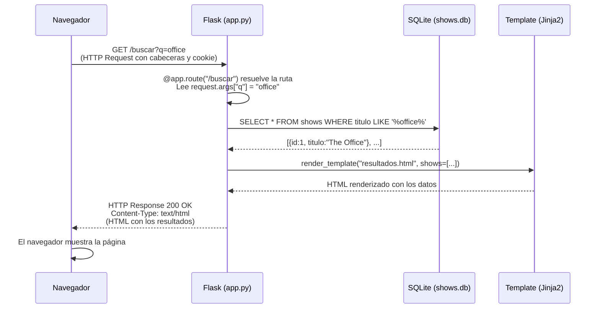
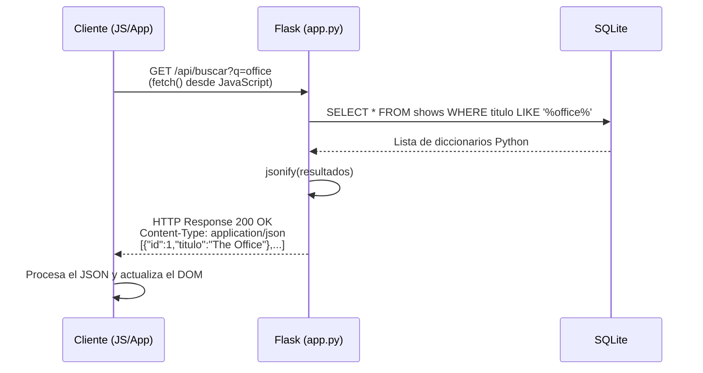

# Clase 9: Flask y Aplicaciones Web con Python

Llegaste a la semana 9 de LocalCode (CS50x). Esta lección es el punto de llegada de todo lo que aprendiste hasta ahora: tomamos Python, SQL y HTML/CSS y los unimos en una **aplicación web real y dinámica** usando **Flask**.

---

## Resumen rápido

| Concepto | En una línea |
|---|---|
| Flask | Micro-framework web de Python |
| Ruta (`@app.route`) | Asocia una URL con una función Python |
| Template Jinja2 | HTML con lógica Python embebida |
| GET / POST | Verbos HTTP para pedir y enviar datos |
| Sesión | Diccionario del servidor que persiste entre requests |
| Cookie | Pequeño dato que el navegador guarda y reenvía |
| CRUD | Create, Read, Update, Delete |
| API REST | Interfaz web que devuelve datos (normalmente JSON) |

---

## 1. ¿Qué es un framework web?

Cuando un navegador visita una URL, envía una **request HTTP** a un servidor. Ese servidor tiene que:

1. Interpretar la URL y el método HTTP (GET, POST, etc.).
2. Ejecutar la lógica de negocio correspondiente (consultar la BD, calcular algo).
3. Devolver una **response HTTP** con el contenido (HTML, JSON, imagen…).

Escribir todo eso desde cero sería tedioso. Un **framework web** es una librería que ya resuelve el repetitivo y te deja concentrarte en la lógica de tu app.

**Flask** es el framework web minimalista de Python. Es el punto de entrada perfecto porque:

- Tiene muy pocas piezas: aprendes lo mínimo y construyes cosas reales.
- No impone una estructura rígida (a diferencia de Django, que es más opinionado).
- Se usa en producción: Instagram empezó con Flask.

---

## 2. Flask: instalación y primera app

Para instalar Flask en tu entorno virtual:

```bash
pip install flask
```

El archivo más pequeño posible de una app Flask:

```python
# app.py
from flask import Flask   # Importamos la clase principal de Flask

app = Flask(__name__)     # Creamos la instancia de la aplicación

@app.route("/")           # Decorador: asocia la URL "/" con la función de abajo
def index():
    return "¡Hola desde Flask!"  # La respuesta HTTP que recibirá el navegador
```

Para ejecutarla:

```bash
flask run
```

Flask inicia un servidor en `http://127.0.0.1:5000` por defecto. Si abres esa URL en el navegador verás el texto `¡Hola desde Flask!`.

> **¿Qué es `__name__`?** Es una variable especial de Python que contiene el nombre del módulo actual. Flask la usa para saber dónde buscar los archivos de templates y assets.

---

## 3. Rutas (`@app.route`)

Una **ruta** es la correspondencia entre una URL y una función Python. El decorador `@app.route` hace esa asociación.

```python
from flask import Flask

app = Flask(__name__)

# Ruta raíz
@app.route("/")
def index():
    return "<h1>Página de inicio</h1>"

# Ruta estática adicional
@app.route("/acerca")
def acerca():
    return "<p>Somos LocalCode, CS50 en español.</p>"

# Ruta dinámica: el segmento <nombre> se convierte en parámetro
@app.route("/hola/<nombre>")
def saludar(nombre):
    return f"<p>¡Hola, {nombre}!</p>"
```

### Métodos HTTP en las rutas

Por defecto, `@app.route` solo acepta requests GET. Para aceptar POST también:

```python
@app.route("/registrar", methods=["GET", "POST"])
def registrar():
    # Aquí se maneja tanto el formulario (POST) como mostrar el form (GET)
    ...
```

Si envías un POST a una ruta que solo acepta GET, Flask devuelve un **405 Method Not Allowed**.

---

## 4. Templates Jinja2

Devolver HTML desde strings de Python escala muy mal. La solución son los **templates**: archivos `.html` separados con marcadores especiales que Flask rellena con datos.

Flask usa **Jinja2** como motor de templates. La función `render_template` busca el archivo en la carpeta `templates/` y le pasa variables.

```
mi-app/
├── app.py
└── templates/
    ├── layout.html      ← Plantilla base
    ├── index.html       ← Extiende layout.html
    └── registrar.html   ← Extiende layout.html
```

### Template base (`layout.html`)

```html
<!DOCTYPE html>
<html lang="es">
<head>
    <title>Mi App</title>
</head>
<body>
    <!-- El bloque "contenido" será reemplazado por cada página hija -->
    
</body>
</html>
```

### Template hija (`index.html`)

```html



    <h1>Bienvenido, {{ nombre }}</h1>
    <p>Hoy es un gran día para aprender.</p>

```

### Sintaxis de Jinja2

| Sintaxis | Uso |
|---|---|
| `{{ variable }}` | Imprime el valor de la variable |
| `` … `` | Condicional |
| `` … `` | Bucle |
| `` | Herencia de template |
| `` … `` | Define un bloque reemplazable |

### Pasando variables al template

```python
from flask import Flask, render_template

app = Flask(__name__)

@app.route("/")
def index():
    usuario = "Valentina"
    # El primer argumento es el archivo; los demás son variables del template
    return render_template("index.html", nombre=usuario)
```

---

## 5. Formularios HTML + Flask

Los formularios HTML envían datos al servidor. Hay dos métodos:

- **GET**: los datos van en la URL (`?nombre=Juan&deporte=futbol`). Se usa para búsquedas.
- **POST**: los datos van en el cuerpo de la request, no en la URL. Se usa para crear o modificar datos.

### Formulario HTML

```html
<!-- templates/registro.html -->



<h1>Registro de deportes</h1>
<form action="/registrar" method="post">
    <!-- Campo de texto -->
    <input name="nombre" placeholder="Tu nombre" type="text">

    <!-- Menú desplegable: el atributo "name" es clave -->
    <select name="deporte">
        <!-- Opción deshabilitada como título visual -->
        <option disabled selected value="">-- Elige un deporte --</option>
        
            <option value="{{ deporte }}">{{ deporte }}</option>
        
    </select>

    <button type="submit">Registrarse</button>
</form>

```

### Manejando el formulario en Flask

```python
from flask import Flask, render_template, request, redirect

app = Flask(__name__)

# Lista oficial de deportes (fuente de verdad en el servidor)
DEPORTES = ["Baloncesto", "Fútbol", "Voleibol", "Ultimate Frisbee"]

@app.route("/")
def index():
    # Pasamos la lista de deportes para que Jinja la itere
    return render_template("registro.html", deportes=DEPORTES)

@app.route("/registrar", methods=["POST"])
def registrar():
    # request.form es un diccionario con los datos enviados por POST
    nombre = request.form.get("nombre")
    deporte = request.form.get("deporte")

    # Validación en el servidor (NUNCA confíes solo en el cliente)
    if not nombre:
        return render_template("error.html", mensaje="Debes ingresar tu nombre.")
    if deporte not in DEPORTES:
        return render_template("error.html", mensaje="Deporte no válido.")

    # Si todo está bien, redirigimos al usuario
    return redirect("/exito")

@app.route("/exito")
def exito():
    return render_template("exito.html")
```

> **Importante — Validación en el servidor:** Un usuario puede abrir las herramientas de desarrollo del navegador y modificar el HTML de tu formulario antes de enviarlo. La validación del lado del cliente (atributo `required`, etc.) mejora la experiencia de usuario pero **nunca es suficiente**. Siempre debes validar en el servidor.

---

## 6. Conectando Flask con SQLite

Almacenar datos en variables Python se pierde cuando el servidor se reinicia. La solución es una base de datos. Usamos la librería `cs50` que envuelve SQLite con una interfaz Python limpia.

```python
from flask import Flask, render_template, request, redirect
from cs50 import SQL

app = Flask(__name__)

# Abrimos (o creamos) la base de datos SQLite
db = SQL("sqlite:///registros.db")

DEPORTES = ["Baloncesto", "Fútbol", "Voleibol"]

@app.route("/")
def index():
    # SELECT: obtenemos todos los registros como lista de diccionarios
    registros = db.execute("SELECT * FROM registrantes")
    return render_template("index.html", registros=registros, deportes=DEPORTES)

@app.route("/registrar", methods=["POST"])
def registrar():
    nombre = request.form.get("nombre")
    deporte = request.form.get("deporte")

    # Validación en el servidor
    if not nombre or deporte not in DEPORTES:
        return render_template("error.html", mensaje="Datos inválidos.")

    # INSERT con placeholders ? para prevenir SQL Injection
    db.execute(
        "INSERT INTO registrantes (nombre, deporte) VALUES (?, ?)",
        nombre, deporte
    )

    # Redirigimos al inicio para ver la lista actualizada
    return redirect("/")

@app.route("/eliminar", methods=["POST"])
def eliminar():
    id_registrante = request.form.get("id")

    if id_registrante:
        # DELETE por ID — el ? evita inyección SQL
        db.execute("DELETE FROM registrantes WHERE id = ?", id_registrante)

    return redirect("/")
```

### Template con tabla y botón de eliminar

```html
<!-- templates/index.html -->



<h1>Registrantes</h1>
<table>
    <thead>
        <tr>
            <th>Nombre</th>
            <th>Deporte</th>
            <th></th>
        </tr>
    </thead>
    <tbody>
        
        <tr>
            <td>{{ r.nombre }}</td>
            <td>{{ r.deporte }}</td>
            <td>
                <!-- Cada fila tiene su propio mini-formulario con un campo oculto -->
                <form action="/eliminar" method="post">
                    <input name="id" type="hidden" value="{{ r.id }}">
                    <button type="submit">Eliminar</button>
                </form>
            </td>
        </tr>
        
    </tbody>
</table>

```

> **Campos ocultos (`type="hidden"`):** Permiten enviar datos junto a un formulario sin que el usuario los vea. Útiles para enviar IDs. Recuerda que el usuario los puede modificar con las devtools, así que valida siempre en el servidor.

---

## 7. Sesiones y cookies

HTTP es un protocolo **sin estado** (stateless): cada request es independiente. El servidor no recuerda quién eres entre una visita y la siguiente. Las **sesiones y cookies** resuelven esto.

### ¿Cómo funciona una cookie?

1. El usuario envía usuario y contraseña al servidor.
2. El servidor verifica las credenciales y responde con una cabecera `Set-Cookie: session=ABC123`.
3. El navegador guarda esa cookie.
4. En cada request posterior, el navegador envía automáticamente `Cookie: session=ABC123`.
5. El servidor asocia ese valor con los datos de sesión de ese usuario.

### Sesiones en Flask

Flask abstrae todo el manejo de cookies a través del objeto `session`, que funciona como un diccionario persistente por usuario:

```python
from flask import Flask, render_template, request, redirect, session

app = Flask(__name__)

# Clave secreta para firmar las cookies (en producción usa algo aleatorio y largo)
app.secret_key = "mi_clave_secreta_muy_segura"

@app.route("/")
def index():
    # Comprobamos si el usuario ya inició sesión
    if "usuario" not in session:
        return redirect("/login")
    return render_template("index.html", usuario=session["usuario"])

@app.route("/login", methods=["GET", "POST"])
def login():
    if request.method == "POST":
        nombre = request.form.get("nombre")
        # En una app real verificarías la contraseña contra la BD
        if nombre:
            session["usuario"] = nombre   # Guardamos el nombre en la sesión
            return redirect("/")
    return render_template("login.html")

@app.route("/logout")
def logout():
    session.clear()       # Borramos todos los datos de la sesión
    return redirect("/login")
```

El objeto `session` de Flask maneja automáticamente:
- La creación de una cookie única por usuario.
- La firma criptográfica (con `secret_key`) para que nadie pueda falsificarla.
- La asociación entre la cookie y los datos en el servidor.

---

## 8. APIs REST en Flask

### ¿Qué es una API?

**API** (Application Programming Interface) es una interfaz que permite a dos programas comunicarse. Una **API REST** es una API que funciona sobre HTTP y devuelve datos estructurados (generalmente **JSON**) en lugar de HTML.

La diferencia clave:

| App web tradicional | API REST |
|---|---|
| Devuelve HTML para que el navegador lo muestre | Devuelve JSON para que otro programa lo procese |
| El usuario final la consume visualmente | Otros desarrolladores la consumen en su código |
| Ejemplo: tu banco en el navegador | Ejemplo: la app móvil de tu banco |

### JSON (JavaScript Object Notation)

JSON es el formato estándar para intercambiar datos en APIs. Es texto plano que representa listas y diccionarios:

```json
[
    {"id": 1, "titulo": "The Office", "año": 2005},
    {"id": 2, "titulo": "Breaking Bad", "año": 2008}
]
```

Python lo entiende nativamente: las listas son `list` y los objetos `{}` son `dict`.

### Construyendo una API con Flask

```python
from flask import Flask, jsonify, request
from cs50 import SQL

app = Flask(__name__)
db = SQL("sqlite:///shows.db")

# Endpoint GET: devuelve todos los shows como JSON
@app.route("/api/shows")
def get_shows():
    shows = db.execute("SELECT id, titulo FROM shows")
    # jsonify convierte la lista de diccionarios a una respuesta JSON
    return jsonify(shows)

# Endpoint GET con búsqueda por parámetro de query (?q=office)
@app.route("/api/buscar")
def buscar():
    # request.args contiene los parámetros de la URL (?clave=valor)
    q = request.args.get("q", "")

    if q:
        # LIKE con % al inicio y al final = búsqueda por subcadena
        resultados = db.execute(
            "SELECT id, titulo FROM shows WHERE titulo LIKE ? LIMIT 50",
            f"%{q}%"
        )
    else:
        resultados = []

    return jsonify(resultados)

# Endpoint POST: crea un nuevo show
@app.route("/api/shows", methods=["POST"])
def crear_show():
    # request.get_json() parsea el cuerpo JSON de la request
    datos = request.get_json()
    titulo = datos.get("titulo")

    if not titulo:
        # Devolvemos un error con código HTTP 400 (Bad Request)
        return jsonify({"error": "Se requiere un título"}), 400

    db.execute("INSERT INTO shows (titulo) VALUES (?)", titulo)
    return jsonify({"mensaje": "Show creado exitosamente"}), 201
```

### Consumiendo la API desde JavaScript (AJAX)

Cuando combinas tu API Flask con JavaScript en el frontend, puedes actualizar partes de la página sin recargarla completa. Esto es lo que hace que las búsquedas en tiempo real funcionen:

```javascript
// Este código va dentro de un <script> en tu template HTML
const input = document.querySelector("input");

// Escuchamos cada vez que el usuario escribe algo
input.addEventListener("input", async function() {
    // fetch() hace una request HTTP desde el navegador
    const respuesta = await fetch(`/api/buscar?q=${input.value}`);

    // .json() parsea la respuesta JSON a un array de JavaScript
    const shows = await respuesta.json();

    // Construimos el HTML con los resultados
    const lista = document.querySelector("ul");
    lista.innerHTML = "";
    for (const show of shows) {
        const li = document.createElement("li");
        li.textContent = show.titulo;
        lista.appendChild(li);
    }
});
```

---

## 9. Diagrama: flujo completo de una request HTTP

Este diagrama muestra qué ocurre desde que el usuario hace clic en "Buscar" hasta que ve los resultados:



### El mismo flujo para una API (devuelve JSON)



---

## 10. Estructura recomendada de un proyecto Flask

```
mi-app/
├── app.py                  ← Lógica principal: rutas, controladores
├── requirements.txt        ← Lista de dependencias (flask, cs50, etc.)
├── mi-app.db               ← Base de datos SQLite
├── static/
│   ├── styles.css          ← CSS propio
│   └── script.js           ← JavaScript propio
└── templates/
    ├── layout.html         ← Template base (HTML completo)
    ├── index.html          ← Página de inicio
    ├── login.html          ← Formulario de inicio de sesión
    └── error.html          ← Página de error genérica
```

---

## 11. El problema set de esta semana: Finance

**CS50 Finance** es un simulador de bolsa de valores. Los usuarios pueden:

- Registrarse e iniciar sesión.
- Buscar el precio actual de acciones reales (via API externa).
- Comprar y vender acciones (CRUD sobre una BD SQLite).
- Ver su portafolio con el valor actual de cada posición.
- Consultar su historial de transacciones.

Este proyecto integra todo lo de esta semana:

| Funcionalidad | Tecnología |
|---|---|
| Login / Logout | Flask + `session` + contraseñas con hash |
| Formularios de compra/venta | HTML forms + POST + validación servidor |
| Precios en tiempo real | Llamada a una API externa desde Python |
| Portafolio y historial | SQLite + `SELECT` con `JOIN` |
| Interfaz dinámica | Jinja2 templates + Bootstrap |

---

## Puntos clave para recordar

1. **Nunca confíes en el cliente.** Siempre valida en el servidor, sin importar qué tan bonita sea la validación del HTML.
2. **Los datos en variables Python se pierden al reiniciar.** Usa una BD para persistencia real.
3. **GET es para leer, POST es para escribir.** No uses GET para acciones que modifiquen datos.
4. **Las sesiones se implementan con cookies**, pero Flask las abstrae para que trabajes con un simple diccionario.
5. **JSON es el idioma de las APIs.** Cualquier lenguaje puede leerlo y escribirlo.
6. **`render_template` + Jinja2** es el puente entre tu Python y el HTML que ve el usuario.
